# Praktikum Codelab_03

| Absen | NIM        | Nama            |
|-------|------------|-----------------|
| 18    | 2341720057 | Khoirotun Nisa' |

---

# Praktikum 1: Menerapkan Control Flows ("if/else")

## Langkah 1-2: 
```dart
void main() {
  String test = "test2";
  if (test == "test1") {
    print("Test1");
  } else if (test == "test2") {
    print("Test2");
  } else {
    print("Something else");
  }

  if (test == "test2") print("Test2 again");
}
```
**Penjelasan**
Program tersebut memeriksa nilai variabel test yang berisi "test2". Karena cocok dengan kondisi if (test == "test2"), maka program mencetak "Test2". Setelah itu, ada pengecekan lagi dengan if satu baris yang juga benar, sehingga program mencetak "Test2 again"
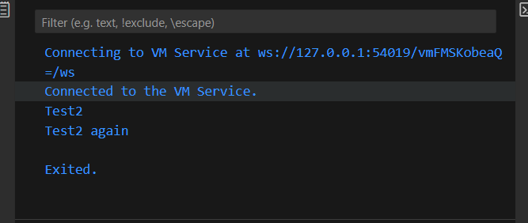

## Langkah 3:
```dart
String test = "true";
if (test) {
  print("Kebenaran");
}
```
**Penjelasan**
Program akan eror, karena terjadi duplikat variabel 'test', Kemudian if hanya menerima nilai bool, bukan String. Jadi "true" sebagai teks1 tidak bisa langsung dipakai sebagai kondisi.
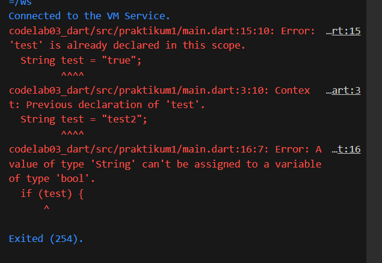

**Perbaikan**
Yang harus dilakukan adalah dengan mengubah nama variabel yang berisi value String "true".  test1 == "true" menghasilkan nilai bool (true atau false) yang valid untuk kondisi if.
```dart
void main() {
  String test1 = "true";
  if (test1 == "true") {
    print("Kebenaran");
  }
}
```
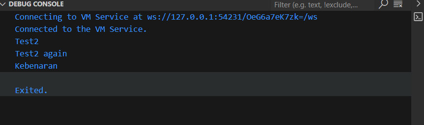

---

# Praktikum 2: Menerapkan Perulangan "while" dan "do-while"

## Langkah 1-2
```dart
while (counter < 33) {
  print(counter);
  counter++;
}
```
**Penjelasan**
Terjadi error karena belum ada inisialiasi variabel di awal. 
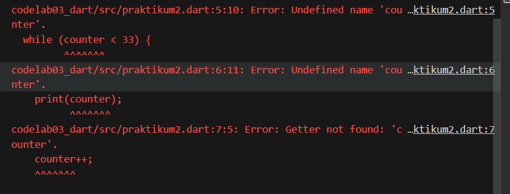
    
**Perbaikan**
```dart
void main() {
  int counter = 0; // Inisialisasi
  while (counter < 33) {
    print(counter);
    counter++;
  }
}
```
Ketika sudah diperbaiki, maka program akan mencetak angka mulai dari nilai awal counter (misalnya 0, jika sudah didefinisikan sebelumnya) sampai 32. Begitu counter menjadi 33, kondisi tidak lagi terpenuhi dan perulangan berhenti.
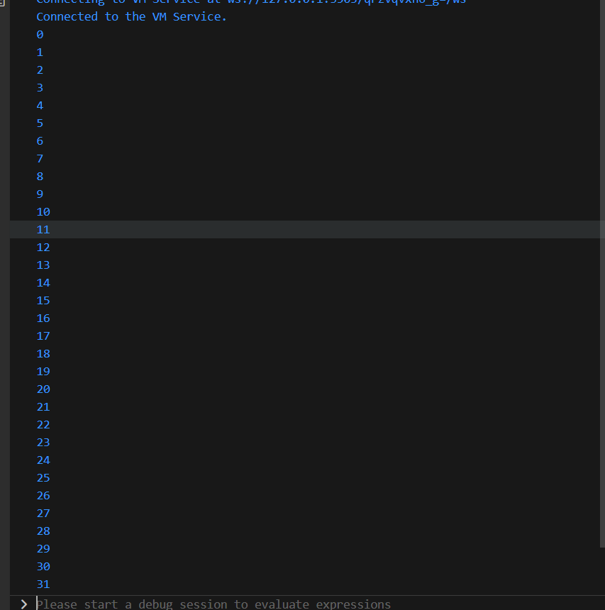

## Langkah 3
```dart
do {
  print(counter);
  counter++;
} while (counter < 77);
```
**Penjelasan**
Kode akan melanjutkan mencetak angka mulai dari nilai awal counter (counter = 33) sampai 76 (Ketika kondisi tidak lagi terpenuh, counter < 77)
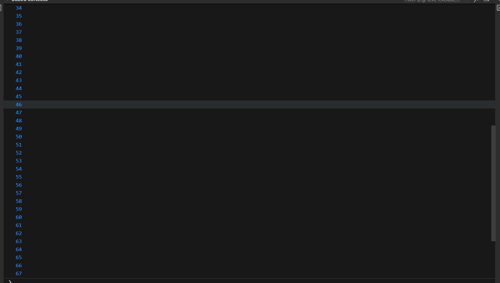

---

# Praktikum 3: Menerapkan Perulangan "for" dan "break-continue"

## Langkah 1-2
```dart
void main() {
  for (Index = 10; index < 27; index) {
    print(Index);
  }
}
```
**Penjelasan**
Program akan error karena variabel index belum di inisialisasi tipe data di awal.
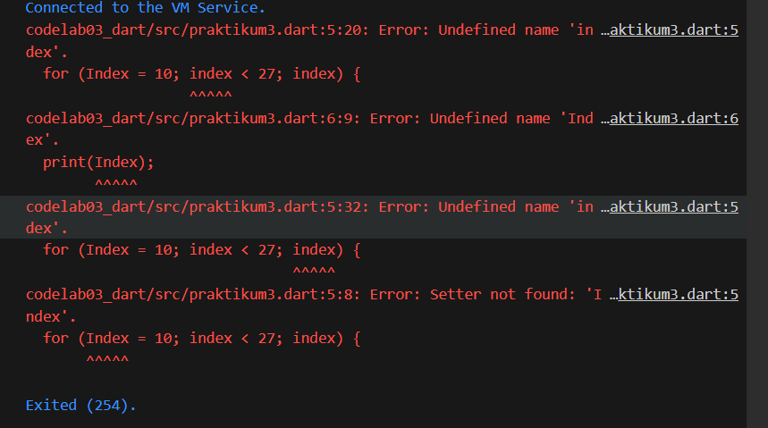

**Perbaikan**
```dart
void main() {
  for (int index = 10; index < 27; index++) {
    print(index);
  }
}
```
Program akan mencetak variabel index mulai dari 10 (karena di beri nilai 10 di awal) sampai kondisi < 27, yaitu 26
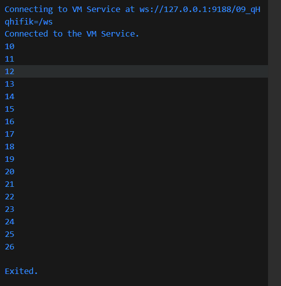

## Langkah 3
```dart
void main() {
  for (int index = 10; index < 27; index++) {
    if (index == 21) break;
    else if (index > 1 && index < 7) continue;
    print(index);
  }
}
```
**Penjelasan**
Kode tersebut menjalankan perulangan for dari 10 hingga kurang dari 27. Setiap nilai index dicetak ke layar, kecuali jika index bernilai 21 maka perulangan dihentikan dengan break. Kondisi continue tidak pernah terpenuhi karena index selalu lebih besar dari 7. Hasil akhirnya, program menampilkan angka 10 sampai 20.
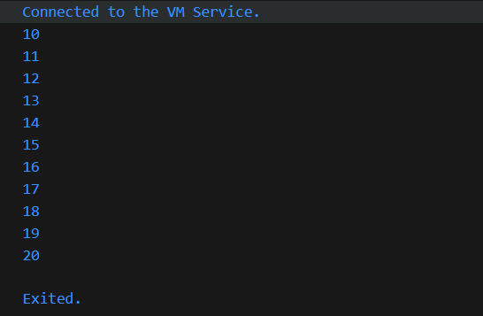

---

# Tugas Praktikum: Menampilkan Bilangan Prima 0-201
**Kode**
```dart
void main() {
  String nama = "Khoirotun Nisa'";
  String nim = "2341720057";

  for (int i = 2; i <= 201; i++) {
    int j;
    for (j = 2; j <= i / 2; j++) {
      if (i % j == 0) {
        break; // Bukan prima
      }
    }

    if (j > i / 2) { // Tidak ditemukan pembagi
      print("$i | $nama | $nim");
    }
  }
}
```
**Penjelasan**
Program tersebut menggunakan dua perulangan untuk menentukan bilangan prima dari 2 hingga 201 tanpa memakai variabel boolean. Perulangan luar (i) berjalan dari 2 sampai 201, sedangkan perulangan dalam (j) mencoba semua kemungkinan pembagi dari 2 hingga setengah dari nilai i. Jika ditemukan j yang membagi habis i (i % j == 0), maka perulangan dalam dihentikan dengan break, menandakan bahwa i bukan bilangan prima. Namun, jika perulangan dalam selesai tanpa break, berarti tidak ada bilangan yang dapat membagi i selain 1 dan dirinya sendiri, sehingga i dianggap bilangan prima. Kondisi ini dideteksi dengan memeriksa apakah nilai j lebih besar dari i/2. Setiap kali angka prima ditemukan, program mencetak bilangan tersebut bersama nama lengkap dan NIM.
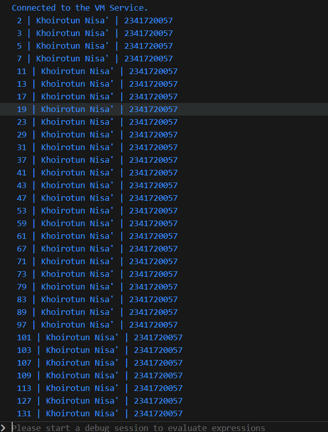
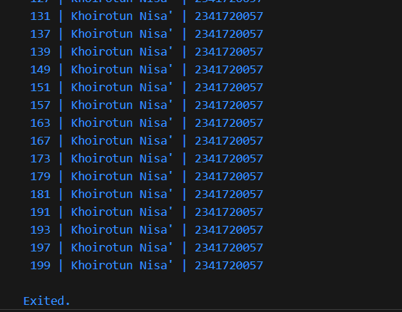