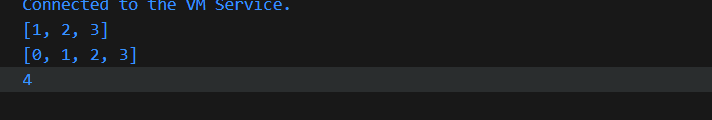
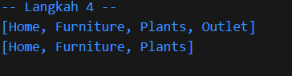

# Praktikum Codelab_04: Collection & Function

| Absen | NIM        | Nama            |
|-------|------------|-----------------|
| 18    | 2341720057 | Khoirotun Nisa' |

---

# Praktikum 1: Eksperimen Tipe Data List

## Langkah 1: Kode
```dart
void main() {
  var list = [1, 2, 3];
  assert(list.length == 3);
  assert(list[1] == 2);
  print(list.length);
  print(list[1]);

  list[1] = 1;
  assert(list[1] == 1);
  print(list[1]);
}
```

## Langkah 2: Penjelasan

Program tersebut mendefinisikan list [1, 2, 3]. Lalu dicek dengan assert yang semuanya benar. Program mencetak panjang list (3), elemen/value indeks ke-1 (2), lalu setelah indeks ke-1 diubah jadi 1, list menjadi [1, 1, 3] dan mencetak 1. Output akhirnya: 3, 2, 1.


## Langkah 3: 
Ubah kode pada langkah 1 menjadi variabel final yang mempunyai index = 5 dengan default value = null. Isilah nama dan NIM Anda pada elemen index ke-1 dan ke-2.
```dart
  print('-- Langkah 2 --');
  final list2 = List<dynamic>.filled(5, null);
  list2[1] = "Khoirotun Nisa'";
  list2[2] = "2341720057";
  print(list2.length);
  print('Nama: ${list2[1]}');
  print('NIM: ${list2[2]}');
```
**Penjelasan**

- Menggunakan tipe dynamic agar bisa menyimpan berbagai tipe data (string untuk nama dan NIM).
- Menggunakan `List<dynamic>.filled(5, null)` untuk membuat list dengan 5 elemen yang semuanya bernilai null.
- Meskipun list dideklarasikan sebagai final, kita masih dapat mengubah nilai elemen-elemen di dalamnya.
- Hasilnya akan menampilkan list dengan panjang 5, di mana indeks ke-1 berisi nama dan indeks ke-2 berisi NIM.


---


# Praktikum 2: Eksperimen Tipe Data Set

## Langkah 1: Kode
```dart
void main(){
  var halogens = {'fluorine', 'chlorine', 'bromine', 'iodine', 'astatine'};
  print(halogens);
}
```

## Langkah 2: Penjelasan

Kode ini menggunakan sintaks literal set (menggunakan kurung kurawal {}) untuk mendeklarasikan sebuah set bernama halogens. Set adalah koleksi yang berisi elemen unik tanpa indeks.


## Langkah 3: 
**Kode:**
```dart
  print('--------');
  var names1 = <String>{};
  Set<String> names2 = {}; // this works too
  var names3 = {}; // this creates a Map, not a Set
  print(names1);
  print(names2);
  print(names3);
```

**Penjelasan**

`names1` dan `names2` adalah `Set<String>` kosong. `names3` bukan Set, melainkan `Map<dynamic, dynamic> `kosong. Jadi kalau kita perlakukan sebagai Set, hasilnya tidak sesuai.


**Kode yang Sudah Diperbaiki:**
```dart
  print('--------');
  var names1 = <String>{};
  Set<String> names2 = {}; // this works too
  // var names3 = {}; // this creates a Map, not a Set

  names1.add("Khoirotun Nisa'");
  names1.add("2341720057");

  names2.addAll({"Khoirotun", "2341720057"});

  print(names1);
  print(names2);
  // print(names3);
```
**Penjelasan**

`names1.add()` untuk menambahkan elemen satu per satu. Sedangkan `names2.addAll({...})` digunakan untuk menambahkan beberapa elemen sekaligus.


---


# Praktikum 3: Eksperimen Tipe Data Maps

## Langkah 1: kode
```dart
void main() {
  var gifts = {
    // key = value
    'first': 'partridge',
    'second': 'turtledoves',
    'fifth': 1
  };

  var nobleGases = {
    2: 'helium',
    10: 'neon',
    18: 2
  };

  print(gifts);
  print(nobleGases);
}
```

## Langkah 2: Penjelasan

Ketika kode tersebut dijalankan, program akan menampilkan isi dari dua buah variabel bertipe `Map`. Variabel `gifts` berisi pasangan key berupa string dengan value berupa string dan integer, sedangkan `nobleGases` berisi pasangan key berupa integer dengan value berups string dan integer. 


## Langkah 3
**Kode**
```dart
  print('-----------------');
  var mhs1 = Map<String, String>();
  gifts['first'] = 'partridge';
  gifts['second'] = 'turtledoves';
  gifts['fifth'] = 'golden rings';
  gifts['nama'] = 'Khoirotun Nisa';
  gifts['NIM'] = '2341720057';

  var mhs2 = Map<int, String>();
  nobleGases[2] = 'helium';
  nobleGases[10] = 'neon';
  nobleGases[18] = 'argon';
  nobleGases[19] = 'Khoirotun Nisa';
  nobleGases[20] = '2341720057';

  mhs1['nama'] = 'Khoirotun Nisa';
  mhs1['NIM'] = '2341720057';
  mhs2[1] = 'Khoirotun Nisa';
  mhs2[2] = '2341720057';

  print(mhs1);
  print(mhs2);
  print(gifts);
  print(nobleGases);
```

**Penjelasan**

- Map dapat diubah nilainya setelah deklarasi, dan bisa menambahkan key-value baru kapan saja. Seperti update di map `gifts` dengan key `fifth` yang sebelumnya bernilai 1 diganti menjadi `golden rings`, kemudian ditambahkan data baru `nama` dan `NIM`. Nilai lama map `nobleGases` juga diganti `argon` dan ditambahkan data baru dengan key 19 dan 20 yang menyimpan nama dan NIM.
- mhs1 adalah map dengan key bertipe String dan value bertipe String.
- mhs2 adalah map dengan key bertipe int dan value bertipe String.


---


# Praktikum 4: Eksperimen Tipe Data List - Spread dan Control-flow Operators


## Langkah 1: Kode
```dart
void main() {
  var list = [1, 2, 3];
  var list2 = [0, ...list];
  print(list);
  print(list2);
  print(list2.length);
}
```

## Langkah 2: Penjelasan

list berisi [1, 2, 3]. Kemudian list2 menggunakan operator spread (...) untuk menyalin isi list ke dalam list baru. Hasilnya [0, 1, 2, 3]. Maka panjang list2 adalah 4 



## Langkah 3: 
**Kode**
```dart
  print('-- Langkah 3 --');
  var list1 = [1,2,null]; //penambahan deklarasi var
  print(list1);
  var list3 = [0, ...?list1];
  print(list3.length);
```

**Penjelasan**

list3 = [0, ...?list1] menyalin isi list1 ke dalam list3. Operator ...? artinya kalau list1 null, maka dilewati saja. Hasilnya [0, 1, 2, null] dengan panjang 4


**Kode Tambahan**
```dart
  print('-- Langkah 3 b --');
  var nim = ['2341720057'];
  var List4 = ['Khoirotun Nisa', ...nim];
  print(List4);
```

**Penjelasan**

nim dibuat berisi `2341720057`. Lalu digabungkan dengan list4 menggunakan spread operator ..., menghasilkan list baru [Khoirotun Nisa, 2341720057].


## Langkah 4: 
**Kode**
```dart
  print('-- Langkah 4 --');
  var nav = ['Home', 'Furniture', 'Plants', if (promoActive) 'Outlet'];
  print(nav);
```

**Penjelasan**

Muncul error karena variabel promoActive belum pernah dideklarasikan


**Kode Perbaikan**
```dart
  print('-- Langkah 4 --');
  bool promoActive = true;
  var nav = ['Home', 'Furniture', 'Plants', if (promoActive) 'Outlet'];
  print(nav);

  promoActive = false;
  var nav2 = ['Home', 'Furniture', 'Plants', if (promoActive) 'Outlet'];
  print(nav2);
```

**Penjelasan**

Dengan menggunakan collection if, elemen `Outlet` hanya ditambahkan ke list jika kondisi `promoActive` bernilai true. Jika false, elemen itu dilewati.



## Langkah 5:
**Kode**
```dart
  print('-- Langkah 5 --');
  var nav3 = ['Home', 'Furniture', 'Plants', if (login case 'Manager') 'Inventory'];
  print(nav3);
```

**Penjelasan**
Variabel login belum pernah dideklarasikan


**Perbaikan Kode**
```dart
  print('-- Langkah 5 --');
  var login = 'Manager';
  var nav3 = ['Home', 'Furniture', 'Plants', if (login case 'Manager') 'Inventory'];
  print(nav3);

  var login2 = 'Guest';
  var nav4 = ['Home', 'Furniture', 'Plants', if (login2 case 'Manager') 'Inventory'];
  print(nav4);
```

**Penjelasan**
Kode ini menggunakan collection if untuk menambahkan elemen ke dalam list hanya jika syarat tertentu terpenuhi. Elemen `Inventory` hanya muncul jika variabel login bernilai `Manager`. Jika kondisi tidak terpenuhi (login = `Guest`), maka elemen tersebut tidak dimasukkan ke dalam list.


## Langkah 6:
**Kode:**
```dart
  print('-- Langkah 6 --');
  var listOfInts = [1, 2, 3];
  var listOfStrings = ['#0', for (var i in listOfInts) '#$i'];
  assert(listOfStrings[1] == '#1');
  print(listOfStrings);
```

**Penjelasan**
Kode membuat listOfInts = [1,2,3]. Lalu listOfStrings diisi ['#0', for (var i in listOfInts) '#$i'], sehingga terbentuk ['#0', '#1', '#2', '#3']. assert memastikan elemen ke-1 adalah '#1'


---


# Praktikum 5: Eksperimen Tipe Data Records

## Langkah 1: Kode
```dart
void main() {
  print('-- Langkah 1 --');
  var record = ('first', a: 2, b: true, 'last');
  print(record);
}
```

## Langkah 2: Penjelasan

Saat dicetak, semua isi record ditampilkan sesuai urutan dalam record dan nama propertinya. Positional fields dicetak di depan (first, last), sedangkan named fields (a, b) dicetak setelahnya.


## Langkah 3:
**Kode**
```dart
(int, int) tukar((int, int) record) {
  var (a, b) = record;
  return (b, a);
}
void main() {
  print('-- Langkah 1 --');
  var record = ('first', a: 2, b: true, 'last');
  print(record);
}
```

**Penjelasan**
Tidak terjadi apapun karena fungsi tukar belum dipanggil


**Kode Tambahan**
```dart
(int, int) tukar((int, int) record) {
  var (a, b) = record;
  return (b, a);
}

void main() {
  print('-- Langkah 1 --');
  var record = ('first', a: 2, b: true, 'last');
  print(record);

  print('-- Langkah 2 --');
  var angka = (1, 2);
  print(angka);
  print(tukar(angka));
}
```

**Penjelasan**

fungsi dipanggil di dalam main. fungsi ini hanya menerima record dengan dua buah int positional (int, int), yaitu (a, b). Kemudian fungsi mengembalikan record baru dengan posisi dibalik (b, a).


## Langkah 4:
**Kode**
```dart
  print('-- Langkah 4 --');
  // record type annotation in a variable declaration:
  (String, int) mahasiswa;
  print(mahasiswa);
```

**Penjelasan**

Terjadi error karena variabel mahasiswa bertipe record (String, int) tapi belum diinisialisasi nilainya.


**Kode Perbaikan**
```dart
  print('-- Langkah 4 --');
  // record type annotation in a variable declaration:
  (String, int) mahasiswa = ("Khoirotun Nisa", 2341720057);
  print(mahasiswa);
```

**Penjelasan**

Kode berhasil dijalankan karena variabel sudah diinisialisasi.


## Langkah 5:
**Kode**
```dart
  print('-- Langkah 5 --');
  var mahasiswa2 = ('Khoirotun', a: 2341720057, b: true, 'last');
  print(mahasiswa2.$1); // positional field
  print(mahasiswa2.a); // named field
  print(mahasiswa2.b); // named field
  print(mahasiswa2.$2); // positional field
```

**Penjelasan**
kode ini mengakses nilai record  dengan urutan posisi (.$1, .$2) dan dengan nama field (.a, .b)


---


# Tugas praktikum
1. **Silakan selesaikan Praktikum 1 sampai 5, lalu dokumentasikan berupa screenshot hasil pekerjaan Anda beserta penjelasannya!**

2. **Jelaskan yang dimaksud Functions dalam bahasa Dart!**
--> functions adalah blok kode yang dapat dipanggil untuk menjalankan suatu tugas tertentu. Function biasanya memiliki nama, dapat menerima parameter (input), dan bisa mengembalikan nilai (output).

3. **Jelaskan jenis-jenis parameter di Functions beserta contoh sintaksnya!**
  - Positional Parameter (wajib, berdasakan urutan)
    Parameter ini harus diisi sesuai urutan ketika memanggil function.
    ```dart
    void cetakData(String nama, int nim) {
      print("Nama: $nama, NIM: $nim");
    }

    void main() {
      cetakData("Khoirotun Nisa", 2341720057);
    }
    ```
    

  - Optional Positional Parameter (opsional, dengan [])
    Parameter dalam kurung siku [] boleh diisi atau tidak.
    ```dart
    void sapa(String nama, [String? pesan]) {
      print("Hai $nama");
      if (pesan != null) print("Pesan: $pesan");
    }

    void main() {
      sapa("Khoirotun");
      sapa("Nisa", "Selamat belajar Dart!");
    }
    ```
    

  - Named Parameter (opsional, dengan {})
    Parameter diberi nama, urutannya bebas saat dipanggil. Bisa ditandai required agar wajib diisi.
    ```dart
    void mahasiswa({required String nama, required int nim}) {
      print("Nama: $nama, NIM: $nim");
    }

    void main() {
      mahasiswa(nama: "Khoirotun Nisa", nim: 2341720057);
    }
    ```
    

  - Default Parameter Value
    Parameter opsional (positional/named) bisa diberi nilai default.
    ```dart
    void greet(String nama, {String pesan = "Selamat datang"}) {
      print("Hai $nama, $pesan");
    }

    void main() {
      greet("Khoirotun");
      greet("Nisa", pesan: "Semoga sukses!");
    }
    ```
    

4. **Jelaskan maksud Functions sebagai first-class objects beserta contoh sintaknya!**
  Dalam Dart, functions adalah first-class objects, artinya function diperlakukan sama seperti data lain (misalnya int, String, atau List). Jadi, function bisa:
  - Disimpan dalam variabel
    ```dart
    void sapa(String nama) {
      print("Hai, $nama!");
    }

    void main() {
      var f = sapa;     // simpan function ke variabel
      f("Khoirotun");   // panggil lewat variabel
    }
    ```
    

  - Dikirim sebagai parameter ke function lain
    ```dart
    void jalankan(Function aksi) {
      aksi(); // eksekusi function yang diterima
    }

    void halo() {
      print("Halo dari fungsi lain!");
    }

    void main() {
      jalankan(halo);  // kirim function sebagai argumen
    }
    ```
    

  - Dikembalikan sebagai nilai dari function lain
    ```dart
    Function buatSapa(String nama) {
      return () => print("Halo, $nama!");
    }

    void main() {
      var sapaNisa = buatSapa("Khoirotun");
      sapaNisa();
    }
    ```
    

5. **Apa itu Anonymous Functions? Jelaskan dan berikan contohnya!**
  Anonymous Function (fungsi anonim) adalah fungsi yang tidak memiliki nama. Fungsi ini biasanya dipakai ketika kita butuh fungsi sederhana untuk sekali pakai, misalnya sebagai argumen dalam function lain atau untuk operasi cepat.

  ```dart
  void main() {
    // Anonymous function disimpan di variabel
    var kaliDua = (int x) {
      return x * 2;
    };
    print(kaliDua(5)); 

    // Anonymous function langsung dipakai sebagai argumen
    var daftar = [1, 2, 3];
    daftar.forEach((angka) {
      print("Angka: $angka");
    });

    // Versi arrow function (lebih singkat)
    daftar.forEach((angka) => print("Kuadrat: ${angka * angka}"));
  }
  ```
  

6. **Jelaskan perbedaan Lexical scope dan Lexical closures! Berikan contohnya!**
  **Lexical Scope** adalah turan tentang ruang lingkup (scope) variabel yang ditentukan berdasarkan posisi variabel dalam kode sumber. Dengan lexical scope, sebuah fungsi bisa mengakses variabel yang didefinisikan di luar (selama masih dalam lingkup kode).
  ```dart
  void main() {
    var nama = "Khoirotun";

    void sapa() {
      print("Halo $nama"); // bisa akses 'nama' karena dalam lexical scope
    }

    sapa(); 
  }
  ```
  Fungsi sapa() bisa “melihat” variabel nama karena ada di lingkup (scope) luarnya.
  

  **Lexical Closure** adalah fungsi yang “mengikat” (capture) variabel dari lexical scope-nya sehingga variabel itu tetap hidup walau scope aslinya sudah selesai. Closure menyimpan state dari lingkup tempat ia dibuat.
  ```dart
  Function buatPenghitung() {
    var hitung = 0;

    return () {
      hitung++;
      return hitung;
    };
  }

  void main() {
    var counter1 = buatPenghitung();
    print(counter1()); // 1
    print(counter1()); // 2
    print(counter1()); // 3

    var counter2 = buatPenghitung();
    print(counter2()); // 1 (mulai hitungan baru)
  }
  ```
  

7. **Jelaskan dengan contoh cara membuat return multiple value di Functions!**
  Dalam Dart, sebuah fungsi hanya bisa mengembalikan satu nilai secara langsung. Namun, jika ingin mengembalikan multiple value (lebih dari satu), biasanya digunakan Record, List, atau Map.
  - Record
    ```dart
    // Fungsi dengan return multiple value menggunakan Record
    (String, int) getDataMahasiswa() {
      return ('Khoirotun', 2341720057);
    }

    void main() {
      var mahasiswa = getDataMahasiswa();
      print(mahasiswa.$1); 
      print(mahasiswa.$2);
    }
    ```
    

  - List
    ```dart
    List getAngka() {
      return [10, 20, 30];
    }

    void main() {
      var angka = getAngka();
      print(angka[0]); 
      print(angka[1]); 
      print(angka[2]); 
    }
    ```
    

  - Map
    ```dart
    Map<String, dynamic> getProfile() {
      return {
        'nama': 'Khoirotun',
        'umur': 21,
      };
    }

    void main() {
      var profile = getProfile();
      print(profile['nama']);
      print(profile['umur']);
    }
    ```
    