# Praktikum Codelab_06: Layout dan Navigasi

| Absen | NIM        | Nama            |
|-------|------------|-----------------|
| 18    | 2341720057 | Khoirotun Nisa' |

---

# Praktikum 1: Membangun Layout di Flutter

## Langkah 1: Buat Project Baru
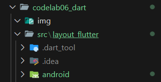

## Langkah 2: 
Kode pada file `lib/main.dart`
```dart
import 'package:flutter/material.dart';

void main() => runApp(const MyApp());

class MyApp extends StatelessWidget {
  const MyApp({super.key});

  @override
  Widget build(BuildContext context) {
    return MaterialApp(
      title: 'Flutter layout: Khoirotun 2341720057',
      home: Scaffold(
        appBar: AppBar(
          title: const Text('Flutter layout demo'),
        ),
        body: const Center(
          child: Text('Hello World'),
        ),
      ),
    );
  }
}
```
Hasil:

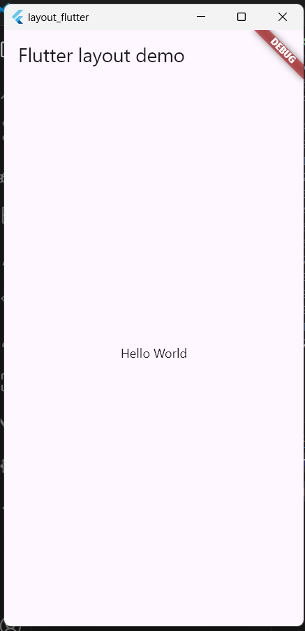

## Langkah 3: Identifikasi Layout Diagram
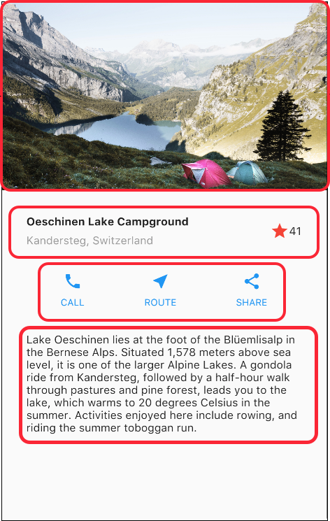
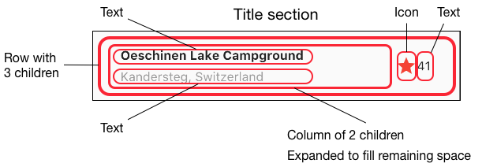
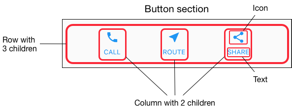

## Langkah 4: Implementasi tile row
Kode di bagian atas metode `build()` di dalam kelas `MyApp`:
```dart
    Widget titleSection = Container(
      padding: const EdgeInsets.all(32),
      child: Row(
        children: [
          Expanded(
            /* soal 1*/
            child: Column(
              crossAxisAlignment: CrossAxisAlignment.start,
              children: [
                /* soal 2*/
                Container(
                  padding: const EdgeInsets.only(bottom: 8),
                  child: const Text(
                    'Wisata Gunung di Batu',
                    style: TextStyle(fontWeight: FontWeight.bold),
                  ),
                ),
                Text(
                  'Batu, Malang, Indonesia',
                  style: TextStyle(color: Colors.grey[500]),
                ),
              ],
            ),
          ),
          /* soal 3*/
          const Icon(Icons.star, color: Colors.red),
          const Text('41'),
        ],
      ),
    );
```

Hasil:

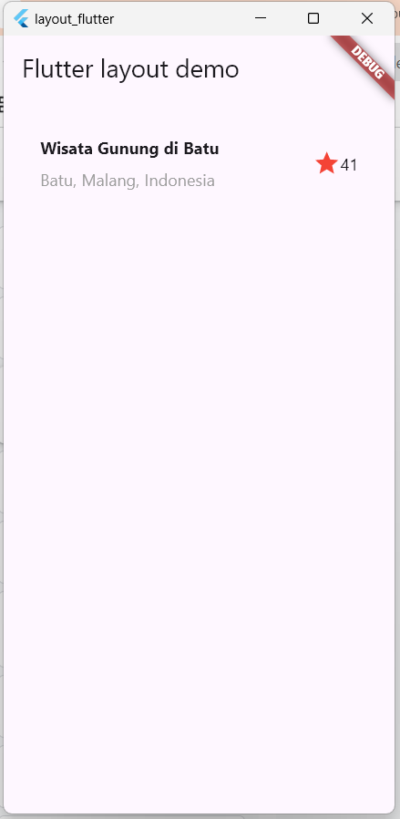

---

# Praktikum 2: Implementasi Button row

## Langkah 1: Buat method Column _buildButtonColumn
kode pada `lib/main.dart(_buildButtonColumn)`
```dart
    Column _buildButtonColumn(Color color, IconData icon, String label) {
        return Column(
        mainAxisSize: MainAxisSize.min,
        mainAxisAlignment: MainAxisAlignment.center,
        children: [
            Icon(icon, color: color),
            Container(
            margin: const EdgeInsets.only(top: 8),
            child: Text(
                label,
                style: TextStyle(
                fontSize: 12,
                fontWeight: FontWeight.w400,
                color: color,
                ),
            ),
            ),
        ],
        );
    }
```
Fungsinya: supaya kita tidak perlu menulis kode yang sama berulang kali untuk setiap tombol. Tinggal panggil _buildButtonColumn(color, icon, text).

## Langkah 2: Buat widget buttonSection

Kode di bawah deklarasi `titleSection`
```dart
Color color = Theme.of(context).primaryColor;

Widget buttonSection = Row(
  mainAxisAlignment: MainAxisAlignment.spaceEvenly,
  children: [
    _buildButtonColumn(color, Icons.call, 'CALL'),
    _buildButtonColumn(color, Icons.near_me, 'ROUTE'),
    _buildButtonColumn(color, Icons.share, 'SHARE'),
  ],
);
```
Row digunakan agar tiga kolom tombol itu sejajar horizontal, dengan jarak sama rata (spaceEvenly).
Setiap kolomnya dipanggil dari _buildButtonColumn.


## Langkah 3: Tambah button section ke body
```dart
    return MaterialApp(
      title: 'Flutter layout: Khoirotun 2341720057',
      home: Scaffold(
        appBar: AppBar(title: const Text('Flutter layout demo')),
        body: Column
          (children: [
            titleSection,
            buttonSection,
          ]),
      ),
    );
```

Hasil:

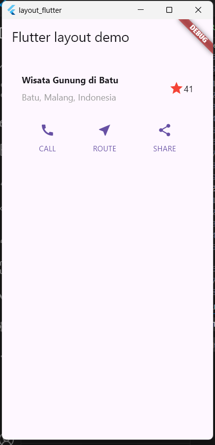

---

# Praktikum 3: Implementasi Text Section

## Langkah 1: Buat Widget textSection
Kode tepat di bawah deklarasi `buttonSection`:
```dart
Widget textSection = Container(
  padding: const EdgeInsets.all(32),
  child: const Text(
    'Raja Ampat adalah surga bahari di Papua Barat yang terkenal dengan '
    'keindahan alam bawah lautnya. Gugusan pulau kecil dengan air biru jernih '
    'menyimpan ribuan spesies ikan dan terumbu karang. Panorama perbukitan dan '
    'pantai yang alami menjadikannya destinasi wisata kelas dunia bagi para pecinta alam '
    'dan penyelam. '
    '\n\nNama: Khoirotun - NIM: 2341720057',
    softWrap: true,
  ),
);
```
Dengan memberi nilai softWrap = true, baris teks akan memenuhi lebar kolom sebelum membungkusnya pada batas kata.

## Langkah 2: Tambahkan Variabel text section ke body
Menambahkan widget variabel textSection ke dalam body 
```dart
    return MaterialApp(
      title: 'Flutter layout: Khoirotun 2341720057',
      home: Scaffold(
        appBar: AppBar(title: const Text('Flutter layout demo')),
        body: Column(children: [titleSection, buttonSection, textSection]),
      ),
    );
```
Hasil:

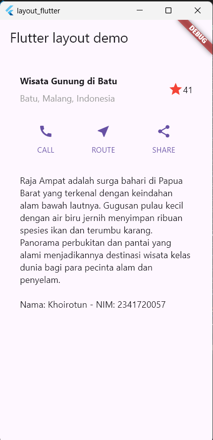

---

# Praktikum 4: Implementasi image section
## Langkah 1: Siapkan Aset Gambar

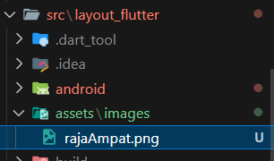

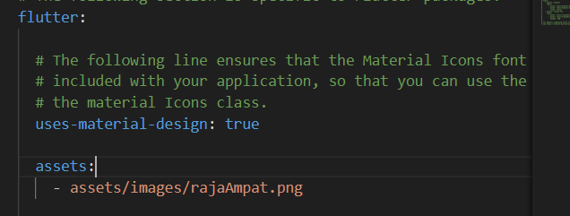

## Langkah 2: Tambahkan gambar ke body
```dart
        children: [
            Image.asset(
              'assets/images/rajaAmpat.png',
              width: 600,
              height: 240,
              fit: BoxFit.cover,
            ),
            titleSection, 
            buttonSection, 
            textSection
        ]),
```
`BoxFit.cover` memberi tahu kerangka kerja bahwa gambar harus sekecil mungkin tetapi menutupi seluruh kotak rendernya.

## Langkah 3: Ubah menjadi ListView
Pada langkah terakhir ini, atur semua elemen dalam ListView, bukan Column, karena ListView mendukung scroll yang dinamis saat aplikasi dijalankan pada perangkat yang resolusinya lebih kecil.
```dart
        body: ListView(
          children: [
            Image.asset(
              'assets/images/rajaAmpat.png',
              width: 600,
              height: 240,
              fit: BoxFit.cover,
            ),
            titleSection, 
            buttonSection, 
            textSection
            ]
        ),
```

Hasil:

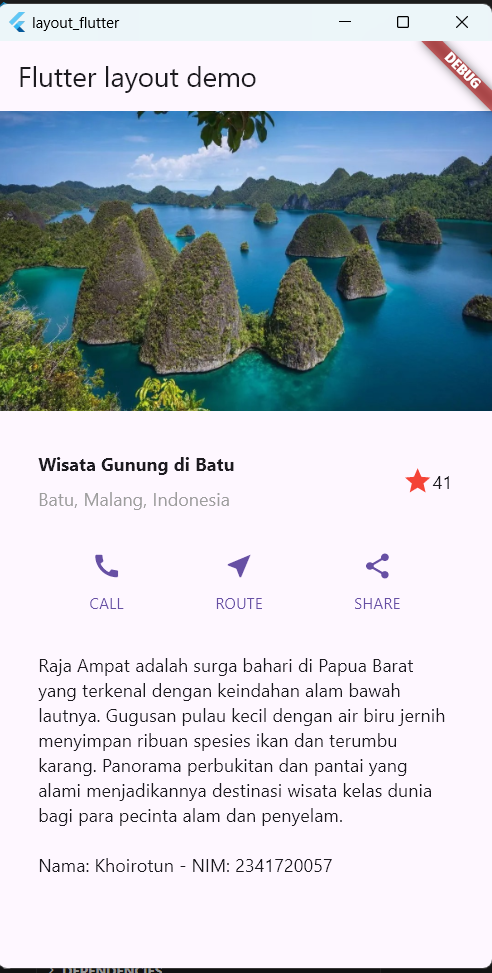