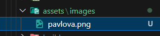
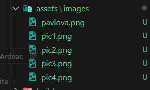
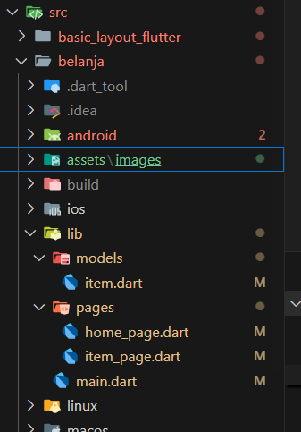
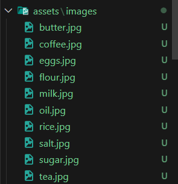

# Praktikum Codelab_06: Layout dan Navigasi

| Absen | NIM        | Nama            |
|-------|------------|-----------------|
| 18    | 2341720057 | Khoirotun Nisa' |

---

# Praktikum 1: Membangun Layout di Flutter

## Langkah 1: Buat Project Baru


## Langkah 2: 
Kode pada file `lib/main.dart`
```dart
import 'package:flutter/material.dart';

void main() => runApp(const MyApp());

class MyApp extends StatelessWidget {
  const MyApp({super.key});

  @override
  Widget build(BuildContext context) {
    return MaterialApp(
      title: 'Flutter layout: Khoirotun 2341720057',
      home: Scaffold(
        appBar: AppBar(
          title: const Text('Flutter layout demo'),
        ),
        body: const Center(
          child: Text('Hello World'),
        ),
      ),
    );
  }
}
```
Hasil:


## Langkah 3: Identifikasi Layout Diagram


## Langkah 4: Implementasi tile row
Kode di bagian atas metode `build()` di dalam kelas `MyApp`:
```dart
    Widget titleSection = Container(
      padding: const EdgeInsets.all(32),
      child: Row(
        children: [
          Expanded(
            /* soal 1*/
            child: Column(
              crossAxisAlignment: CrossAxisAlignment.start,
              children: [
                /* soal 2*/
                Container(
                  padding: const EdgeInsets.only(bottom: 8),
                  child: const Text(
                    'Wisata Gunung di Batu',
                    style: TextStyle(fontWeight: FontWeight.bold),
                  ),
                ),
                Text(
                  'Batu, Malang, Indonesia',
                  style: TextStyle(color: Colors.grey[500]),
                ),
              ],
            ),
          ),
          /* soal 3*/
          const Icon(Icons.star, color: Colors.red),
          const Text('41'),
        ],
      ),
    );
```

Hasil:


---

# Praktikum 2: Implementasi Button row

## Langkah 1: Buat method Column _buildButtonColumn
kode pada `lib/main.dart(_buildButtonColumn)`
```dart
    Column _buildButtonColumn(Color color, IconData icon, String label) {
        return Column(
        mainAxisSize: MainAxisSize.min,
        mainAxisAlignment: MainAxisAlignment.center,
        children: [
            Icon(icon, color: color),
            Container(
            margin: const EdgeInsets.only(top: 8),
            child: Text(
                label,
                style: TextStyle(
                fontSize: 12,
                fontWeight: FontWeight.w400,
                color: color,
                ),
            ),
            ),
        ],
        );
    }
```
Fungsinya: supaya kita tidak perlu menulis kode yang sama berulang kali untuk setiap tombol. Tinggal panggil _buildButtonColumn(color, icon, text).

## Langkah 2: Buat widget buttonSection

Kode di bawah deklarasi `titleSection`
```dart
Color color = Theme.of(context).primaryColor;

Widget buttonSection = Row(
  mainAxisAlignment: MainAxisAlignment.spaceEvenly,
  children: [
    _buildButtonColumn(color, Icons.call, 'CALL'),
    _buildButtonColumn(color, Icons.near_me, 'ROUTE'),
    _buildButtonColumn(color, Icons.share, 'SHARE'),
  ],
);
```
Row digunakan agar tiga kolom tombol itu sejajar horizontal, dengan jarak sama rata (spaceEvenly).
Setiap kolomnya dipanggil dari _buildButtonColumn.


## Langkah 3: Tambah button section ke body
```dart
    return MaterialApp(
      title: 'Flutter layout: Khoirotun 2341720057',
      home: Scaffold(
        appBar: AppBar(title: const Text('Flutter layout demo')),
        body: Column
          (children: [
            titleSection,
            buttonSection,
          ]),
      ),
    );
```

Hasil:


---

# Praktikum 3: Implementasi Text Section

## Langkah 1: Buat Widget textSection
Kode tepat di bawah deklarasi `buttonSection`:
```dart
Widget textSection = Container(
  padding: const EdgeInsets.all(32),
  child: const Text(
    'Raja Ampat adalah surga bahari di Papua Barat yang terkenal dengan '
    'keindahan alam bawah lautnya. Gugusan pulau kecil dengan air biru jernih '
    'menyimpan ribuan spesies ikan dan terumbu karang. Panorama perbukitan dan '
    'pantai yang alami menjadikannya destinasi wisata kelas dunia bagi para pecinta alam '
    'dan penyelam. '
    '\n\nNama: Khoirotun - NIM: 2341720057',
    softWrap: true,
  ),
);
```
Dengan memberi nilai softWrap = true, baris teks akan memenuhi lebar kolom sebelum membungkusnya pada batas kata.

## Langkah 2: Tambahkan Variabel text section ke body
Menambahkan widget variabel textSection ke dalam body 
```dart
    return MaterialApp(
      title: 'Flutter layout: Khoirotun 2341720057',
      home: Scaffold(
        appBar: AppBar(title: const Text('Flutter layout demo')),
        body: Column(children: [titleSection, buttonSection, textSection]),
      ),
    );
```
Hasil:


---

# Praktikum 4: Implementasi image section
## Langkah 1: Siapkan Aset Gambar


## Langkah 2: Tambahkan gambar ke body
```dart
        children: [
            Image.asset(
              'assets/images/rajaAmpat.png',
              width: 600,
              height: 240,
              fit: BoxFit.cover,
            ),
            titleSection, 
            buttonSection, 
            textSection
        ]),
```
`BoxFit.cover` memberi tahu kerangka kerja bahwa gambar harus sekecil mungkin tetapi menutupi seluruh kotak rendernya.

## Langkah 3: Ubah menjadi ListView
Pada langkah terakhir ini, atur semua elemen dalam ListView, bukan Column, karena ListView mendukung scroll yang dinamis saat aplikasi dijalankan pada perangkat yang resolusinya lebih kecil.
```dart
        body: ListView(
          children: [
            Image.asset(
              'assets/images/rajaAmpat.png',
              width: 600,
              height: 240,
              fit: BoxFit.cover,
            ),
            titleSection, 
            buttonSection, 
            textSection
            ]
        ),
```

Hasil:


---

# Tugas Praktikum 1
## Membuat Project Baru : basic_layout_flutter


## Tata Letak Widget

### Aplikasi Standard
Kode `main.dart`
```dart
import 'package:flutter/material.dart';

void main() => runApp(const MyApp());

class MyApp extends StatelessWidget {
  const MyApp({super.key});

  @override
  Widget build(BuildContext context) {
    return Container(
      decoration: const BoxDecoration(color: Colors.white),
      child: const Center(
        child: Text(
          'Hello World',
          textDirection: TextDirection.ltr,
          style: TextStyle(fontSize: 32, color: Colors.black87),
        ),
      ),
    );
  }
}
```
Hasil:


### Aplikasi Material
Kode `main.dart`
```dart
class MyApp extends StatelessWidget {
  const MyApp({super.key});

  @override
  Widget build(BuildContext context) {
    const String appTitle = 'Flutter layout demo';
    return MaterialApp(
      title: appTitle,
      home: Scaffold(
        appBar: AppBar(title: const Text(appTitle)),
        body: const Center(
          child: Text('Hello World'),
        ),
      ),
    );
  }
}
```
Hasil:


### Aplikasi Cupertino
Kode `main.dart`
```dart
import 'package:flutter/cupertino.dart';

void main() => runApp(const MyApp());

class MyApp extends StatelessWidget {
  const MyApp({super.key});

  @override
  Widget build(BuildContext context) {
    return const CupertinoApp(
      title: 'Flutter layout demo',
      theme: CupertinoThemeData(
        brightness: Brightness.light,
        primaryColor: CupertinoColors.systemBlue,
      ),
      home: CupertinoPageScaffold(
        navigationBar: CupertinoNavigationBar(
          backgroundColor: CupertinoColors.systemGrey,
          middle: Text('Flutter layout demo'),
        ),
        child: Center(
          child: Column(
            mainAxisAlignment: MainAxisAlignment.center,
            children: [Text('Hello World')],
          ),
        ),
      ),
    );
  }
}
```
Hasil:


## Tata Beberapa Widget Secara Vertikal dan Horizontal
### Menyelaraskan Widget
Dengan menggunakan `MainAxisAlligment` dan `CrossAxisAlligment`, sehingga kode pada `main.dart`:
```dart
import 'package:flutter/material.dart';

void main() => runApp(const MyApp());

class MyApp extends StatelessWidget {
  const MyApp({super.key});

  @override
  Widget build(BuildContext context) {
    return MaterialApp(
      title: 'Flutter layout demo',
      home: Scaffold(
        appBar: AppBar(title: const Text('Flutter layout demo')),
        body: Center(
          child: Column(
            mainAxisAlignment: MainAxisAlignment.center, // vertikal
            crossAxisAlignment: CrossAxisAlignment.center, // horizontal
            children: const [
              Text('Top'), 
              Text('Middle'), 
              Text('Bottom')
            ],
          ),
        ),
      ),
    );
  }
}
```
Hasil:


### Ukuran Widget
Menentukan ukuran widget dengan container, sehingga pada `main.dart`:
```dart
body: Center(
  child: Column(
    mainAxisAlignment: MainAxisAlignment.center,
    children: [
      Container(
        color: Colors.red,
        padding: const EdgeInsets.all(10),
        child: const Text('Red Box'),
      ),
      Container(
        color: Colors.green,
        padding: const EdgeInsets.all(20),
        child: const Text('Green Box'),
      ),
      Container(
        color: Colors.blue,
        padding: const EdgeInsets.all(30),
        child: const Text('Blue Box'),
      ),
    ],
  ),
),
```
Hasil:


### Mengemas Widget
Mengemas widget dalam row dan kolom, sehingga:
```dart
body: Center(
  child: Column(
    mainAxisAlignment: MainAxisAlignment.center,
    children: [
      Row(
        mainAxisAlignment: MainAxisAlignment.spaceEvenly,
        children: const [
          Icon(Icons.star, color: Colors.orange),
          Icon(Icons.star, color: Colors.orange),
          Icon(Icons.star, color: Colors.orange),
        ],
      ),
      const SizedBox(height: 20),
      const Text('3 Stars!'),
    ],
  ),
),
```
Hasil:


### Menyusun Bais dan Kolom
Menyusun layout pavlova
```dart
import 'package:flutter/material.dart';

void main() => runApp(const MyApp());

class MyApp extends StatelessWidget {
  const MyApp({super.key});

  @override
  Widget build(BuildContext context) {
    return MaterialApp(
      title: 'Flutter layout demo',
      home: Scaffold(
        appBar: AppBar(
          title: const Text('Flutter layout demo'),
        ),
        body: Center(
          child: Container(
            margin: const EdgeInsets.fromLTRB(0, 40, 0, 30),
            height: 600,
            child: Card(
              child: Row(
                crossAxisAlignment: CrossAxisAlignment.start,
                children: [
                  SizedBox(width: 440, child: leftColumn),
                  mainImage,
                ],
              ),
            ),
          ),
        ),
      ),
    );
  }
}

final mainImage = Image.asset(
  'assets/images/pavlova.png', // letakkan gambar di folder images/
  fit: BoxFit.cover,
);

final titleText = const Text(
  'Strawberry Pavlova',
  style: TextStyle(
    fontWeight: FontWeight.w800,
    letterSpacing: 0.5,
    fontSize: 30,
  ),
);

final subTitle = const Text(
  'Pavlova is a meringue-based dessert named after the Russian ballerina Anna Pavlova. '
  'Pavlova features a crisp crust and soft, light inside, topped with fruit and whipped cream.',
  textAlign: TextAlign.center,
  style: TextStyle(fontSize: 18),
);

final stars = Row(
  mainAxisSize: MainAxisSize.min,
  children: [
    Icon(Icons.star, color: Colors.green[500]),
    Icon(Icons.star, color: Colors.green[500]),
    Icon(Icons.star, color: Colors.green[500]),
    const Icon(Icons.star, color: Colors.black),
    const Icon(Icons.star, color: Colors.black),
  ],
);

final ratings = Container(
  padding: const EdgeInsets.all(20),
  child: Row(
    mainAxisAlignment: MainAxisAlignment.spaceEvenly,
    children: [
      stars,
      const Text(
        '170 Reviews',
        style: TextStyle(
          color: Colors.black,
          fontWeight: FontWeight.w800,
          fontFamily: 'Roboto',
          letterSpacing: 0.5,
          fontSize: 20,
        ),
      ),
    ],
  ),
);

const descTextStyle = TextStyle(
  color: Colors.black,
  fontWeight: FontWeight.w800,
  fontFamily: 'Roboto',
  letterSpacing: 0.5,
  fontSize: 18,
  height: 2,
);

final iconList = DefaultTextStyle.merge(
  style: descTextStyle,
  child: Container(
    padding: const EdgeInsets.all(20),
    child: Row(
      mainAxisAlignment: MainAxisAlignment.spaceEvenly,
      children: [
        Column(
          children: [
            Icon(Icons.kitchen, color: Colors.green[500]),
            const Text('PREP:'),
            const Text('25 min'),
          ],
        ),
        Column(
          children: [
            Icon(Icons.timer, color: Colors.green[500]),
            const Text('COOK:'),
            const Text('1 hr'),
          ],
        ),
        Column(
          children: [
            Icon(Icons.restaurant, color: Colors.green[500]),
            const Text('FEEDS:'),
            const Text('4-6'),
          ],
        ),
      ],
    ),
  ),
);

final leftColumn = Container(
  padding: const EdgeInsets.fromLTRB(20, 30, 20, 20),
  child: Column(
    mainAxisAlignment: MainAxisAlignment.center,
    children: [titleText, subTitle, ratings, iconList],
  ),
);
```

Lokasi image:


pubspec.yaml


Hasil:


Menggunakan refactoring agar main.dart lebih efesien

main.dart:
```dart
import 'package:flutter/material.dart';
import 'pavlova_page.dart';

void main() => runApp(const MyApp());

class MyApp extends StatelessWidget {
  const MyApp({super.key});

  @override
  Widget build(BuildContext context) {
    return const MaterialApp(
      title: 'Flutter Layout Demo',
      home: PavlovaPage(),
    );
  }
}
```

## Common Layouts Widget
### Container
file `lib/container/main.dart`
```dart
import 'package:flutter/material.dart';

void main() => runApp(const MyApp());

class MyApp extends StatelessWidget {
  const MyApp({super.key});

  @override
  Widget build(BuildContext context) {
    return MaterialApp(
      home: Scaffold(
        appBar: AppBar(title: const Text('Widget Tata Letak: Container')),
        body: SingleChildScrollView(
          // agar bisa di-scroll
          child: Center(child: _buildImageColumn()),
        ),
      ),
    );
  }
}

Widget _buildImageColumn() {
  return Container(
    padding: const EdgeInsets.all(8),
    decoration: const BoxDecoration(color: Colors.black12),
    child: Column(children: [_buildImageRow(1), _buildImageRow(3)]),
  );
}

Widget _buildImageRow(int imageIndex) => Row(
  mainAxisAlignment: MainAxisAlignment.center,
  children: [
    _buildDecoratedImage(imageIndex),
    _buildDecoratedImage(imageIndex + 1),
  ],
);

Widget _buildDecoratedImage(int imageIndex) => Flexible(
  child: Container(
    width: 150, // ukuran gambar diseragamkan
    height: 150,
    decoration: BoxDecoration(
      border: Border.all(width: 5, color: Colors.black38),
      borderRadius: const BorderRadius.all(Radius.circular(8)),
    ),
    margin: const EdgeInsets.all(8),
    child: ClipRRect(
      borderRadius: BorderRadius.circular(8),
      child: Image.asset(
        'assets/images/pic$imageIndex.png',
        fit: BoxFit.cover, // agar gambar tidak melar
      ),
    ),
  ),
);
```
Asset:


Hasil:


### Grid View
file `lib/grid/main.dart`
```dart
import 'package:flutter/material.dart';

void main() => runApp(const MyApp());

class MyApp extends StatelessWidget {
  const MyApp({super.key});

  @override
  Widget build(BuildContext context) {
    return MaterialApp(
      home: Scaffold(
        appBar: AppBar(title: const Text('Widget Tata Letak: GridView')),
        body: _buildGrid(),
      ),
    );
  }
}

Widget _buildGrid() => GridView.extent(
  maxCrossAxisExtent: 150,
  padding: const EdgeInsets.all(4),
  mainAxisSpacing: 4,
  crossAxisSpacing: 4,
  children: _buildGridTileList(8),
);

List<Widget> _buildGridTileList(int count) =>
    List.generate(count, (i) => Image.asset('assets/images/pic${i+1}.png'));

```

Hasil:

Grid berisi 3 kolom (bergantung ukuran layar) yang bisa digulir.

### List View
kode pada `lib/listView/main.dart`
```dart
import 'package:flutter/material.dart';

void main() => runApp(const MyApp());

class MyApp extends StatelessWidget {
  const MyApp({super.key});

  @override
  Widget build(BuildContext context) {
    return MaterialApp(
      home: Scaffold(
        appBar: AppBar(title: const Text('Widget Tata Letak: ListView')),
        body: _buildList(),
      ),
    );
  }
}

Widget _buildList() {
  return ListView(
    children: [
      _tile('CineArts at the Empire', '85 W Portal Ave', Icons.theaters),
      _tile('The Castro Theater', '429 Castro St', Icons.theaters),
      _tile('Alamo Drafthouse Cinema', '2550 Mission St', Icons.theaters),
      _tile('Roxie Theater', '3117 16th St', Icons.theaters),
      _tile('AMC Metreon 16', '135 4th St #3000', Icons.theaters),
      const Divider(),
      _tile('K\'s Kitchen', '757 Monterey Blvd', Icons.restaurant),
      _tile('Emmy\'s Restaurant', '1923 Ocean Ave', Icons.restaurant),
      _tile('Chaiya Thai Restaurant', '272 Claremont Blvd', Icons.restaurant),
      _tile('La Ciccia', '291 30th St', Icons.restaurant),
    ],
  );
}

ListTile _tile(String title, String subtitle, IconData icon) {
  return ListTile(
    title: Text(
      title,
      style: const TextStyle(fontWeight: FontWeight.w500, fontSize: 20),
    ),
    subtitle: Text(subtitle),
    leading: Icon(icon, color: Colors.blue[500]),
  );
}
```
Hasil:

daftar bioskop & restoran dengan ikon dan pemisah.

### Stack
Kode pada `lib/stack/main.dart`
```dart
import 'package:flutter/material.dart';

void main() => runApp(const MyApp());

class MyApp extends StatelessWidget {
  const MyApp({super.key});

  @override
  Widget build(BuildContext context) {
    return MaterialApp(
      home: Scaffold(
        appBar: AppBar(title: const Text('Widget Tata Letak: Stack')),
        body: Center(child: _buildStack()),
      ),
    );
  }
}

Widget _buildStack() {
  return Stack(
    alignment: const Alignment(0.6, 0.6),
    children: [
      const CircleAvatar(
        backgroundImage: AssetImage('assets/images/pic1.png'),
        radius: 100,
      ),
      Container(
        decoration: const BoxDecoration(color: Colors.black45),
        child: const Text(
          'Kucing Meong Lucu',
          style: TextStyle(
            fontSize: 20,
            fontWeight: FontWeight.bold,
            color: Colors.white,
          ),
        ),
      ),
    ],
  );
}
```

Hasil: 


### Card
Kode pada `lib/card/main.dart`
```dart
import 'package:flutter/material.dart';

void main() => runApp(const MyApp());

class MyApp extends StatelessWidget {
  const MyApp({super.key});

  @override
  Widget build(BuildContext context) {
    return MaterialApp(
      home: Scaffold(
        appBar: AppBar(title: const Text('Widget Tata Letak: Card')),
        body: Center(child: _buildCard()),
      ),
    );
  }
}

Widget _buildCard() {
  return SizedBox(
    height: 340, // diperbesar sedikit agar muat gambar
    width: 300,
    child: Card(
      elevation: 8,
      clipBehavior: Clip.antiAlias, //agar gambar ikut terpotong sesuai border card
      shape: RoundedRectangleBorder(
        borderRadius: BorderRadius.circular(12),
      ),
      child: Column(
        crossAxisAlignment: CrossAxisAlignment.start,
        children: [
          // Tambahkan gambar di bagian atas card
          Image.asset(
            'assets/images/street.png',
            height: 140,
            width: double.infinity,
            fit: BoxFit.cover,
          ),
          const ListTile(
            title: Text(
              '1625 Main Street',
              style: TextStyle(fontWeight: FontWeight.w500),
            ),
            subtitle: Text('My City, CA 99984'),
            leading: Icon(Icons.restaurant_menu, color: Colors.blue),
          ),
          const Divider(),
          const ListTile(
            title: Text(
              '(408) 555-1212',
              style: TextStyle(fontWeight: FontWeight.w500),
            ),
            leading: Icon(Icons.contact_phone, color: Colors.blue),
          ),
          const ListTile(
            title: Text('costa@example.com'),
            leading: Icon(Icons.contact_mail, color: Colors.blue),
          ),
        ],
      ),
    ),
  );
}
```
Hasil:


### List Title
Kode pada `lib/listTitle/main.dart`
```dart
import 'package:flutter/material.dart';

void main() => runApp(const MyApp());

class MyApp extends StatelessWidget {
  const MyApp({super.key});

  @override
  Widget build(BuildContext context) {
    return MaterialApp(
      home: Scaffold(
        appBar: AppBar(title: const Text('Widget Tata Letak: ListTile')),
        body: ListView(
          children: const [
            ListTile(
              leading: CircleAvatar(
                backgroundImage: AssetImage('assets/images/pic1.png'),
              ),
              title: Text('Mia B'),
              subtitle: Text('Flutter Developer'),
              trailing: Icon(Icons.favorite, color: Colors.red),
            ),
            Divider(),
            ListTile(
              leading: CircleAvatar(
                backgroundImage: AssetImage('assets/images/pic2.png'),
              ),
              title: Text('Liam P'),
              subtitle: Text('UI Designer'),
              trailing: Icon(Icons.star, color: Colors.amber),
            ),
          ],
        ),
      ),
    );
  }
}
```
Hasil:


## Hasil Demo
`main.dart`
```dart
import 'package:flutter/material.dart';
import 'screens/cat_gallery_screen.dart';

void main() {
  runApp(const CatGalleryApp());
}

class CatGalleryApp extends StatelessWidget {
  const CatGalleryApp({super.key});

  @override
  Widget build(BuildContext context) {
    return MaterialApp(
      title: 'Khoirotun Nisa - Cat Gallery',
      theme: ThemeData(
        primarySwatch: Colors.purple,
        scaffoldBackgroundColor: Colors.grey[100],
      ),
      home: const CatGalleryScreen(),
      debugShowCheckedModeBanner: false,
    );
  }
}
```

Kode pada `lib/screens/cat_gallery_screen.dart`
```dart
import 'package:flutter/material.dart';

class CatGalleryScreen extends StatelessWidget {
  const CatGalleryScreen({super.key});

  @override
  Widget build(BuildContext context) {
    final catImages = List.generate(8, (i) => 'assets/images/pic${i + 1}.png');

    return Scaffold(
      appBar: AppBar(
        title: const Text('Khoirotun Nisa Cat Gallery 🐾'),
        centerTitle: true,
        backgroundColor: Colors.purple,
      ),
      body: ListView(
        children: [
          // STACK: Header bergambar
          Stack(
            alignment: Alignment.bottomLeft,
            children: [
              Image.asset('assets/images/pic1.png', fit: BoxFit.cover, height: 220, width: double.infinity),
              Container(
                width: double.infinity,
                color: Colors.black54,
                padding: const EdgeInsets.all(16),
                child: const Text(
                  'Welcome to Nisa’s Cat World',
                  style: TextStyle(color: Colors.white, fontSize: 22, fontWeight: FontWeight.bold),
                ),
              ),
            ],
          ),

          // CONTAINER: Deskripsi
          Container(
            padding: const EdgeInsets.all(16),
            color: Colors.white,
            child: const Text(
              'Kucing adalah sahabat manusia yang lucu, lembut, dan penuh kasih. '
              'Di galeri ini, kamu bisa melihat beberapa momen menggemaskan dari para kucing kesayangan Nisa 🐾',
              style: TextStyle(fontSize: 16, height: 1.5),
              textAlign: TextAlign.justify,
            ),
          ),

          // GRIDVIEW: Koleksi gambar kucing
          Padding(
            padding: const EdgeInsets.all(8),
            child: GridView.extent(
              shrinkWrap: true,
              physics: const NeverScrollableScrollPhysics(),
              maxCrossAxisExtent: 150,
              mainAxisSpacing: 8,
              crossAxisSpacing: 8,
              children: catImages.map((path) {
                return Container(
                  decoration: BoxDecoration(
                    borderRadius: BorderRadius.circular(8),
                    border: Border.all(color: Colors.purple.shade100, width: 3),
                  ),
                  child: ClipRRect(
                    borderRadius: BorderRadius.circular(8),
                    child: Image.asset(path, fit: BoxFit.cover),
                  ),
                );
              }).toList(),
            ),
          ),

          // CARD + LISTTILE: Info kontak
          Padding(
            padding: const EdgeInsets.all(16),
            child: Card(
              elevation: 4,
              shape: RoundedRectangleBorder(borderRadius: BorderRadius.circular(12)),
              child: Column(
                children: const [
                  ListTile(
                    leading: Icon(Icons.pets, color: Colors.purple),
                    title: Text('Khoirotun Nisa'),
                    subtitle: Text('Cat Lover & Photographer'),
                  ),
                  Divider(),
                  ListTile(
                    leading: Icon(Icons.email, color: Colors.purple),
                    title: Text('nisa.catlover@example.com'),
                  ),
                  ListTile(
                    leading: Icon(Icons.phone, color: Colors.purple),
                    title: Text('+62 812-3456-7890'),
                  ),
                ],
              ),
            ),
          ),

          // FOOTER kecil
          const Padding(
            padding: EdgeInsets.symmetric(vertical: 16),
            child: Center(
              child: Text(
                '© 2025 Khoirotun Nisa 🐾 All cats are loved.',
                style: TextStyle(color: Colors.grey),
              ),
            ),
          ),
        ],
      ),
    );
  }
}

```


---

# Praktikum 5: Membangun Navigasi dan Rute
## Langkah 1: Siapkan Project Baru


## Langkah 2: Mendefinisikan Route
Routes:


Kode pada home_page.dart
```dart
import 'package:flutter/material.dart';

class HomePage extends StatelessWidget {
  @override
  Widget build(BuildContext context) {
    throw UnimplementedError();
  }
}
```

Kode pada item_page.dart
```dart
import 'package:flutter/material.dart';

class ItemPage extends StatelessWidget {
  @override
  Widget build(BuildContext context) {
    throw UnimplementedError();
  }
}
```

## Langkah 3: Kode pada `main.dart`
```dart
import 'package:belanja/pages/home_page.dart';
import 'package:belanja/pages/item_page.dart';
import 'package:flutter/material.dart';


void main() {
  runApp(MaterialApp(
    initialRoute: '/',
    routes: {
      '/': (context) => HomePage(),
      '/item': (context) => ItemPage(),
    },
  ));
}
```

## Langkah 4: Membuat data Model
Kode pada `lib/models/item.dart`
```dart
 class Item {
  String name;
  int price;

  Item({required this.name, required this.price});
 }
```

## Langkah 5: Class HomePage
```dart
import 'package:flutter/material.dart';
import 'package:belanja/models/item.dart';

class HomePage extends StatelessWidget {
  final List<Item> items = [
    Item(name: 'Sugar', price: 5000),
    Item(name: 'Salt', price: 2000),
  ];
  @override
  Widget build(BuildContext conctext) {
    throw UnimplementedError();
  }
}
```

## Langkah 6: Membuat ListView dan itemBuilder
```dart
import 'package:flutter/material.dart';
import 'package:belanja/models/item.dart';

class HomePage extends StatelessWidget {
  final List<Item> items = [
    Item(name: 'Sugar', price: 5000),
    Item(name: 'Salt', price: 2000),
  ];
  @override
  Widget build(BuildContext context) {
    return Scaffold(
      appBar: AppBar(
        backgroundColor: Theme.of(context).colorScheme.inversePrimary,
        title: Text('Khoirotun Nisa - 2341720057'),
      ),
      body: Container(
        margin: EdgeInsets.all(8),
        child: ListView.builder(
          padding: EdgeInsets.all(8),
          itemCount: items.length,
          itemBuilder: (context, index) {
            final item = items[index];
            return Card(
              child: Container(
                margin: EdgeInsets.all(8),
                child: Row(
                  children: [
                    Expanded(child: Text(item.name)),
                    Expanded(
                      child: Text(
                        item.price.toString(),
                        textAlign: TextAlign.end,
                      ),
                    ),
                  ],
                ),
              ),
            );
          },
        ),
      ),
    );
  }
}
```

Hasil:


## Langkah 7: Menambahkan aksi pada ListView
```dart
return InkWell(
  onTap: () {
    Navigator.pushNamed(context, '/item', arguments: item);
  },
```

Hasil

Sudah bisa diklik walaupun hasilnya unimplemented/error karena item_page belum diisi


---

# Tugas Praktikum 2

Router:

Projek ini menggunakan Flutter dengan struktur sederhana yang terdiri dari empat file utama, yaitu main.dart, models/item.dart, pages/home_page.dart, dan pages/item_page.dart.
File main.dart berfungsi sebagai titik awal aplikasi dan mengatur rute navigasi antar halaman. File models/item.dart berisi model data produk (Item). File home_page.dart menampilkan daftar produk dalam bentuk grid, sedangkan item_page.dart menampilkan detail produk yang dipilih.

Assets:


Kode pada `lib/main.dart`
```dart
import 'package:belanja/pages/home_page.dart';
import 'package:belanja/pages/item_page.dart';
import 'package:flutter/material.dart';


void main() {
  runApp(MaterialApp(
    debugShowCheckedModeBanner: false,
    initialRoute: '/',
    routes: {
      '/': (context) => HomePage(),
      '/item': (context) => ItemPage(),
    },
  ));
}
```
Pada main.dart, aplikasi dijalankan menggunakan `MaterialApp` dengan dua rute utama: halaman utama (HomePage) dan halaman detail (ItemPage). Navigasi antar halaman dilakukan dengan `Navigator.pushNamed()` yang juga mengirimkan data produk sebagai argument.


Kode pada `lib/models/item.dart`
```dart
class Item {
  String name;
  int price;
  String photo;
  int stock;
  double rating;
  String description;

  Item({
    required this.name,
    required this.price,
    required this.photo,
    required this.stock,
    required this.rating,
    required this.description,
  });
}

```
Model Item di models/item.dart berisi properti seperti nama, harga, foto, stok, rating, dan deskripsi yang digunakan untuk menampilkan informasi produk di aplikasi.

Kode pada `lib/pages/home_page.dart`
```dart
import 'package:flutter/material.dart';
import 'package:belanja/models/item.dart';

class HomePage extends StatelessWidget {
  final List<Item> items = [
  Item(
    name: 'Sugar',
    price: 5000,
    photo: 'assets/images/sugar.jpg',
    stock: 12,
    rating: 4.5,
    description: 'Gula pasir berkualitas tinggi, cocok untuk kebutuhan sehari-hari.',
  ),
  Item(
    name: 'Salt',
    price: 2000,
    photo: 'assets/images/salt.jpg',
    stock: 25,
    rating: 4.2,
    description: 'Garam dapur murni, ideal untuk memasak dan pengawetan makanan.',
  ),
  Item(
    name: 'Milk',
    price: 10000,
    photo: 'assets/images/milk.jpg',
    stock: 10,
    rating: 4.8,
    description: 'Susu segar berkualitas tinggi, kaya akan kalsium dan nutrisi.',
  ),
  Item(
    name: 'Rice',
    price: 12000,
    photo: 'assets/images/rice.jpg',
    stock: 50,
    rating: 4.6,
    description: 'Beras premium dengan tekstur pulen dan aroma harum.',
  ),
  Item(
    name: 'Cooking Oil',
    price: 15000,
    photo: 'assets/images/oil.jpg',
    stock: 20,
    rating: 4.4,
    description: 'Minyak goreng berkualitas tinggi, jernih dan tahan panas.',
  ),
  Item(
    name: 'Coffee',
    price: 25000,
    photo: 'assets/images/coffee.jpg',
    stock: 18,
    rating: 4.9,
    description: 'Kopi bubuk pilihan dengan aroma khas dan rasa kuat.',
  ),
  Item(
    name: 'Tea',
    price: 8000,
    photo: 'assets/images/tea.jpg',
    stock: 30,
    rating: 4.3,
    description: 'Teh hitam berkualitas tinggi dengan cita rasa khas dan menyegarkan.',
  ),
  Item(
    name: 'Flour',
    price: 7000,
    photo: 'assets/images/flour.jpg',
    stock: 15,
    rating: 4.1,
    description: 'Tepung terigu serbaguna untuk berbagai kebutuhan masakan.',
  ),
  Item(
    name: 'Butter',
    price: 18000,
    photo: 'assets/images/butter.jpg',
    stock: 8,
    rating: 5.0,
    description: 'Mentega lembut berkualitas premium untuk kue dan masakan.',
  ),
  Item(
    name: 'Eggs',
    price: 2500,
    photo: 'assets/images/eggs.jpg',
    stock: 60,
    rating: 3.0,
    description: 'Telur ayam segar, sumber protein tinggi untuk kebutuhan harian.',
  ),
];


  @override
  Widget build(BuildContext context) {
    return Scaffold(
      appBar: AppBar(
        backgroundColor: Colors.green,
        title: const Text('Khoirotun Nisa - 2341720057'),
        centerTitle: true,
      ),
      body: GridView.builder(
        padding: const EdgeInsets.all(8),
        gridDelegate: const SliverGridDelegateWithFixedCrossAxisCount(
          crossAxisCount: 2, // 2 kolom
          mainAxisSpacing: 8,
          crossAxisSpacing: 8,
          childAspectRatio: 0.75,
        ),
        itemCount: items.length,
        itemBuilder: (context, index) {
          final item = items[index];
          return InkWell(
            onTap: () {
              Navigator.pushNamed(context, '/item', arguments: item);
            },
            child: Card(
              shape: RoundedRectangleBorder(
                borderRadius: BorderRadius.circular(12),
              ),
              elevation: 4,
              child: Column(
                crossAxisAlignment: CrossAxisAlignment.stretch,
                children: [
                  Expanded(
                    child: Hero(
                      tag: item.name,
                      child: ClipRRect(
                        borderRadius: const BorderRadius.vertical(top: Radius.circular(12)),
                        child: Image.asset(item.photo, fit: BoxFit.cover),
                      ),
                    ),
                  ),
                  Padding(
                    padding: const EdgeInsets.all(8),
                    child: Column(
                      crossAxisAlignment: CrossAxisAlignment.start,
                      children: [
                        Text(item.name, style: const TextStyle(fontWeight: FontWeight.bold)),
                        Text('Rp ${item.price}'),
                        Row(
                          mainAxisAlignment: MainAxisAlignment.spaceBetween,
                          children: [   
                            Row(
                              mainAxisSize: MainAxisSize.min,
                              children: [
                                const Icon(
                                  Icons.star,
                                  color: Colors.orange,
                                  size: 16,
                                ),
                                const SizedBox(width: 4),
                                Text('${item.rating}'),
                              ],
                            ),
                            Text('Stok: ${item.stock}'),
                          ],
                        ),
                      ],
                    ),
                  ),
                ],
              ),
            ),
          );
        },
      ),
      bottomNavigationBar: const Padding(
        padding: EdgeInsets.all(8),
        child: Text(
          'Khoirotun Nisa - 2341720057',
          textAlign: TextAlign.center,
          style: TextStyle(color: Colors.grey),
        ),
      ),
    );
  }
}

```

Halaman `HomePage` menampilkan semua produk menggunakan `GridView.builder`, di mana setiap produk ditampilkan dalam bentuk Card yang berisi gambar, harga, rating, dan stok. Ketika pengguna menekan salah satu produk, data produk dikirim ke halaman detail dengan Navigator.

Kode pada `lib/pages/item_page.dart`
```dart
import 'package:flutter/material.dart';
import 'package:belanja/models/item.dart';

class ItemPage extends StatelessWidget {
  const ItemPage({super.key});

  @override
  Widget build(BuildContext context) {
    final item = ModalRoute.of(context)!.settings.arguments as Item;

    return Scaffold(
      appBar: AppBar(
        backgroundColor: Colors.green,
        title: Text(item.name),
        centerTitle: true,
        elevation: 0,
      ),
      body: SingleChildScrollView(
        child: Column(
          crossAxisAlignment: CrossAxisAlignment.stretch,
          children: [
            // Hero Image Section
            Hero(
              tag: item.name,
              child: Container(
                height: 250,
                decoration: const BoxDecoration(
                  color: Colors.white,
                  boxShadow: [
                    BoxShadow(
                      color: Colors.black12,
                      blurRadius: 8,
                      offset: Offset(0, 2),
                    ),
                  ],
                ),
                child: ClipRRect(
                  borderRadius: const BorderRadius.vertical(
                    bottom: Radius.circular(20),
                  ),
                  child: Image.asset(
                    item.photo,
                    fit: BoxFit.cover,
                  ),
                ),
              ),
            ),
            
            // Content Section
            Padding(
              padding: const EdgeInsets.all(20),
              child: Column(
                crossAxisAlignment: CrossAxisAlignment.start,
                children: [
                  // Product Name
                  Text(
                    item.name,
                    style: Theme.of(context).textTheme.headlineMedium?.copyWith(
                      fontWeight: FontWeight.bold,
                      color: Colors.black87,
                    ),
                  ),
                  const SizedBox(height: 12),
                  
                  // Product Info Card
                  Card(
                    elevation: 2,
                    shape: RoundedRectangleBorder(
                      borderRadius: BorderRadius.circular(12),
                    ),
                    child: Padding(
                      padding: const EdgeInsets.all(16),
                      child: Column(
                        children: [
                          // Price
                          Row(
                            children: [
                              const Icon(
                                Icons.attach_money,
                                color: Colors.green,
                                size: 24,
                              ),
                              const SizedBox(width: 8),
                              const Text(
                                'Harga:',
                                style: TextStyle(
                                  fontSize: 16,
                                  fontWeight: FontWeight.w500,
                                ),
                              ),
                              const Spacer(),
                              Text(
                                'Rp ${item.price.toString().replaceAllMapped(RegExp(r'(\d{1,3})(?=(\d{3})+(?!\d))'), (Match m) => '${m[1]}.')}',
                                style: const TextStyle(
                                  fontSize: 18,
                                  fontWeight: FontWeight.bold,
                                  color: Colors.green,
                                ),
                              ),
                            ],
                          ),
                          const Divider(height: 24),
                          
                          // Stock
                          Row(
                            children: [
                              const Icon(
                                Icons.inventory,
                                color: Colors.blue,
                                size: 24,
                              ),
                              const SizedBox(width: 8),
                              const Text(
                                'Stok tersedia:',
                                style: TextStyle(
                                  fontSize: 16,
                                  fontWeight: FontWeight.w500,
                                ),
                              ),
                              const Spacer(),
                              Container(
                                padding: const EdgeInsets.symmetric(
                                  horizontal: 12,
                                  vertical: 4,
                                ),
                                decoration: BoxDecoration(
                                  color: item.stock > 10 ? Colors.green.shade100 : Colors.orange.shade100,
                                  borderRadius: BorderRadius.circular(20),
                                ),
                                child: Text(
                                  '${item.stock} unit',
                                  style: TextStyle(
                                    fontSize: 14,
                                    fontWeight: FontWeight.w600,
                                    color: item.stock > 10 ? Colors.green.shade700 : Colors.orange.shade700,
                                  ),
                                ),
                              ),
                            ],
                          ),
                          const Divider(height: 24),
                          
                          // Rating
                          Row(
                            children: [
                              const Icon(
                                Icons.star,
                                color: Colors.orange,
                                size: 24,
                              ),
                              const SizedBox(width: 8),
                              const Text(
                                'Rating:',
                                style: TextStyle(
                                  fontSize: 16,
                                  fontWeight: FontWeight.w500,
                                ),
                              ),
                              const Spacer(),
                              Row(
                                children: [
                                  ...List.generate(5, (index) {
                                    return Icon(
                                      index < item.rating.floor()
                                          ? Icons.star
                                          : index < item.rating
                                              ? Icons.star_half
                                              : Icons.star_border,
                                      color: Colors.orange,
                                      size: 18,
                                    );
                                  }),
                                  const SizedBox(width: 8),
                                  Text(
                                    '${item.rating}/5',
                                    style: const TextStyle(
                                      fontSize: 16,
                                      fontWeight: FontWeight.w600,
                                      color: Colors.orange,
                                    ),
                                  ),
                                ],
                              ),
                            ],
                          ),
                        ],
                      ),
                    ),
                  ),
                  
                  const SizedBox(height: 20),
                  
                  // Description Section
                  Card(
                    elevation: 2,
                    shape: RoundedRectangleBorder(
                      borderRadius: BorderRadius.circular(12),
                    ),
                    child: Padding(
                      padding: const EdgeInsets.all(16),
                      child: Column(
                        crossAxisAlignment: CrossAxisAlignment.start,
                        children: [
                          Row(
                            children: [
                              const Icon(
                                Icons.description,
                                color: Colors.purple,
                                size: 24,
                              ),
                              const SizedBox(width: 8),
                              Text(
                                'Deskripsi Produk',
                                style: Theme.of(context).textTheme.titleLarge?.copyWith(
                                  fontWeight: FontWeight.bold,
                                  color: Colors.purple,
                                ),
                              ),
                            ],
                          ),
                          const SizedBox(height: 12),
                          Text(
                            '${item.description}',
                            style: TextStyle(
                              fontSize: 16,
                              height: 1.5,
                              color: Colors.black87,
                            ),
                          ),
                        ],
                      ),
                    ),
                  ),
                  
                  const SizedBox(height: 20),
                  
                  // Add to Cart Button
                  SizedBox(
                    width: double.infinity,
                    height: 50,
                    child: ElevatedButton.icon(
                      onPressed: () {});
                      },
                      icon: const Icon(Icons.shopping_cart),
                      label: const Text(
                        'Tambah ke Keranjang',
                        style: TextStyle(fontSize: 16, fontWeight: FontWeight.bold),
                      ),
                      style: ElevatedButton.styleFrom(
                        backgroundColor: Colors.green,
                        foregroundColor: Colors.white,
                        shape: RoundedRectangleBorder(
                          borderRadius: BorderRadius.circular(12),
                        ),
                        elevation: 2,
                      ),
                    ),
                  ),
                ],
              ),
            ),
          ],
        ),
      ),
      bottomNavigationBar: Container(
        padding: const EdgeInsets.all(16),
        decoration: const BoxDecoration(
          color: Colors.white,
          boxShadow: [
            BoxShadow(
              color: Colors.black12,
              blurRadius: 4,
              offset: Offset(0, -2),
            ),
          ],
        ),
        child: const Text(
          'Khoirotun Nisa - 2341720057',
          textAlign: TextAlign.center,
          style: TextStyle(
            color: Colors.grey,
            fontSize: 14,
            fontWeight: FontWeight.w500,
          ),
        ),
      ),
    );
  }
}
```
Halaman `ItemPage` menerima data tersebut menggunakan `ModalRoute.of(context)!.settings.arguments` dan menampilkan detail produk secara lengkap. Tampilan dilengkapi dengan animasi transisi Hero, tombol “Tambah ke Keranjang”, serta elemen visual seperti Card, Row, dan Icon untuk memperjelas informasi produk.


Hasil:

Ketika aplikasi dijalankan, halaman utama (HomePage) langsung tampil menampilkan daftar produk. Pengguna dapat memilih produk, lalu aplikasi berpindah ke halaman detail (ItemPage) untuk menampilkan informasi lengkap. Pengguna kemudian dapat kembali ke halaman utama menggunakan tombol kembali di AppBar.

Beberapa widget utama yang digunakan antara lain  `MaterialApp`, `Scaffold`, `AppBar`, `GridView`.`builder`, `Card`, `Image.asset`, `InkWell`, `Hero`, `SingleChildScrollView`, `ElevatedButton`.`icon`. Komponen-komponen ini digunakan untuk membangun antarmuka yang interaktif, navigasi antar halaman, serta memberikan efek animasi kepada pengguna.


