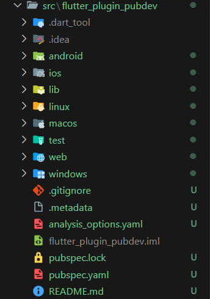
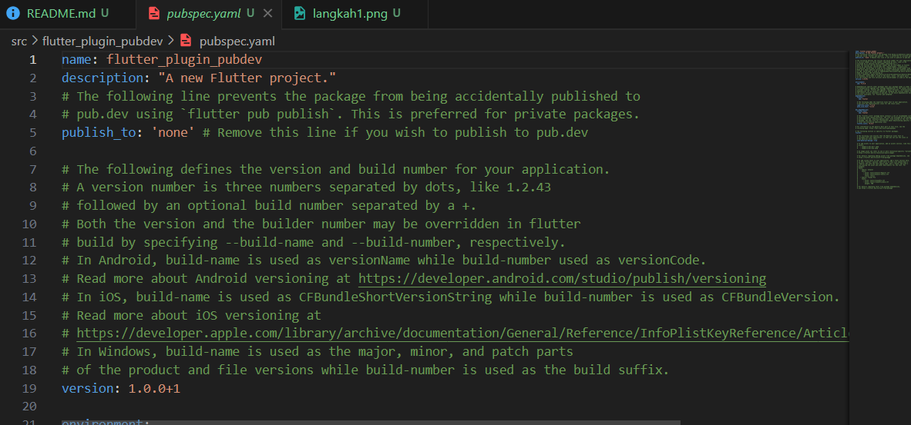
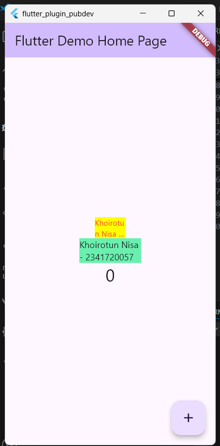

# Praktikum Codelab_07: Manajemen Plugin

| Absen | NIM        | Nama            |
|-------|------------|-----------------|
| 18    | 2341720057 | Khoirotun Nisa' |

---

# Praktikum Menerapkan Plugin di Project Flutter

## Langkah 1: Buat Project Baru


## Langkah 2: Menambahkan Plugin
Tambahkan plugin auto_size_text menggunakan perintah berikut di terminal
```dart
flutter pub add auto_size_text
```
Hasil :


## Langkah 3: Buat file red_text_widget_dart
Kode:
```dart
import 'package:flutter/material.dart';

class RedTextWidget extends StatelessWidget {
  const RedTextWidget({Key? key}) : super(key: key);

  @override
  Widget build(BuildContext context) {
    return Container();
  }
}
```

## Langkah 4: Tambahkan Widget AutoSizeText
Masih di file red_text_widget.dart, untuk menggunakan plugin auto_size_text, ubahlah kode return Container() menjadi seperti berikut
```dart
return AutoSizeText(
      text,
      style: const TextStyle(color: Colors.red, fontSize: 14),
      maxLines: 2,
      overflow: TextOverflow.ellipsis,
);
```

Terjadi error karena variabel text belum didefinisikan dalam widget RedTextWidget.

## Langkah 5: Buat Variabel Text dan Parameter di Construktor  
```dart
final String text;

const RedTextWidget({Key? key, required this.text}) : super(key: key);
```

## Langkah 6: Tambahkan Widget di main.dart
di dalam `children` pada class `MyHomePageState`
```dart
Container(
   color: Colors.yellowAccent,
   width: 50,
   child: const RedTextWidget(
             text: 'You have pushed the button this many times:',
          ),
),
Container(
    color: Colors.greenAccent,
    width: 100,
    child: const Text(
           'You have pushed the button this many times:',
          ),
),
```
Hasil :



# Tugas Praktikum

2. Pada langkah 2, kegiatan ini bertujuan untuk menambahkan plugin eksternal dari `pub.dev` ke dalam proyek Flutter, yaitu `auto_size_text`. Plugin ini digunakan agar ukuran teks dapat menyesuaikan secara otomatis dengan ruang tampilan (container), sehingga teks tidak terpotong atau meluap saat ditampilkan.

3. Pada langkah 5, dilakukan penambahan variabel text dan parameter pada konstruktor di dalam kelas `RedTextWidget`. Tujuannya agar widget ini dapat menerima nilai teks dari luar kelas dan menampilkannya melalui plugin `AutoSizeText`. Dengan cara ini, teks menjadi lebih fleksibel dan dapat digunakan ulang dengan isi berbeda.

4. Pada langkah 6, terdapat dua widget yang ditambahkan, yaitu `RedTextWidget` dan `Text`. Keduanya sama-sama menampilkan teks, tetapi `RedTextWidget` menggunakan `AutoSizeText` yang mampu menyesuaikan ukuran huruf secara otomatis sesuai lebar container, sedangkan Text biasa menampilkan teks dengan ukuran tetap tanpa penyesuaian otomatis.

5. Plugin `auto_size_text` sendiri memiliki beberapa parameter penting, seperti `minFontSize` dan `maxFontSize` untuk mengatur batas ukuran teks, `maxLines` untuk membatasi jumlah baris, `overflow` untuk menentukan cara teks yang meluap ditampilkan, `group` untuk menyamakan ukuran beberapa teks sekaligus, serta `stepGranularity` dan `presetFontSizes` untuk mengatur tingkat penyesuaian ukuran huruf. Semua parameter tersebut berfungsi untuk memastikan teks tetap terbaca dan proporsional di berbagai ukuran tampilan.
