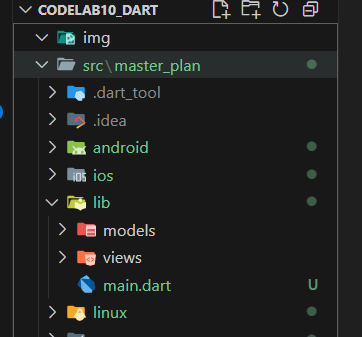
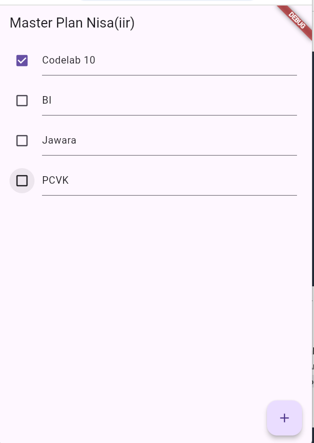
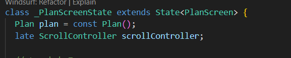
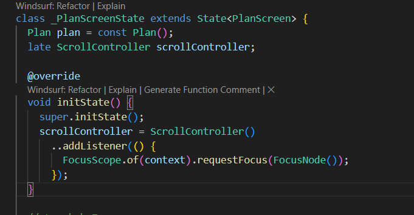
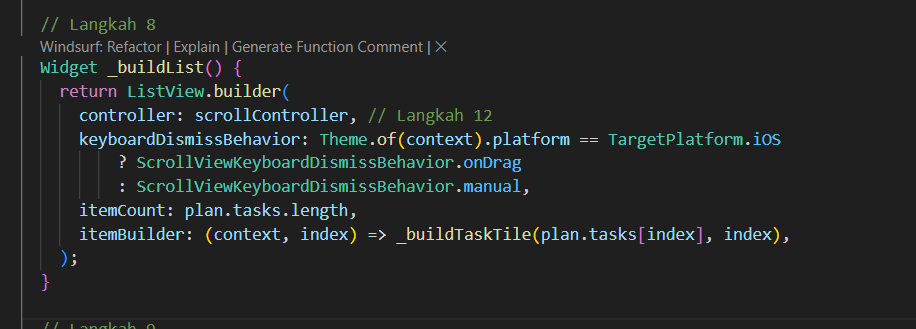
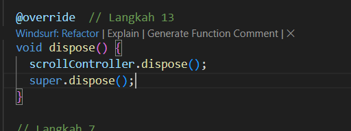

# Praktikum Codelab_10: Dasar State Manajemen

| Absen | NIM        | Nama            |
|-------|------------|-----------------|
| 18    | 2341720057 | Khoirotun Nisa' |

---

# Praktikum 1: Dasar State dengan Model-View

## Langkah 1: Buat Project Baru


## Langkah 2: Membuat model `lib/models/task.dart`
```dart
class Task {
  final String description;
  final bool complete;
  
  const Task({
    this.complete = false,
    this.description = '',
  });
}
```

## Langkah 3: Buat file `lib/models/plan.dart`
```dart
import './task.dart';

class Plan {
  final String name;
  final List<Task> tasks;
  
  const Plan({this.name = '', this.tasks = const []});
}
```

## Langkah 4: `lib/models/data_layer.dart`
```dart
export 'plan.dart';
export 'task.dart';
```

## Langkah 5: `lib/main.dart`
```dart
import 'package:flutter/material.dart';
import './views/plan_screen.dart';

void main() => runApp(MasterPlanApp());

class MasterPlanApp extends StatelessWidget {
  const MasterPlanApp({super.key});

  @override
  Widget build(BuildContext context) {
    return MaterialApp(
     theme: ThemeData(primarySwatch: Colors.purple),
     home: PlanScreen(),
    );
  }
}
```

## Langkah 6-9: `lib/views/plan_screen.dart`
```dart
import '../models/data_layer.dart';
import 'package:flutter/material.dart';

class PlanScreen extends StatefulWidget {
  const PlanScreen({super.key});

  @override
  State createState() => _PlanScreenState();
}

class _PlanScreenState extends State<PlanScreen> {
  Plan plan = const Plan();

  // Langkah 7
  Widget _buildAddTaskButton() {
    return FloatingActionButton(
      child: const Icon(Icons.add),
      onPressed: () {
        setState(() {
          plan = Plan(
            name: plan.name,
            tasks: List<Task>.from(plan.tasks)..add(const Task()),
          );
        });
      },
    );
  }

  // Langkah 8
  Widget _buildList() {
    return ListView.builder(
      itemCount: plan.tasks.length,
      itemBuilder: (context, index) => _buildTaskTile(plan.tasks[index], index),
    );
  }

  // Langkah 9
  Widget _buildTaskTile(Task task, int index) {
    return ListTile(
      leading: Checkbox(
        value: task.complete,
        onChanged: (selected) {
          setState(() {
            plan = Plan(
              name: plan.name,
              tasks: List<Task>.from(plan.tasks)
                ..[index] = Task(
                  description: task.description,
                  complete: selected ?? false,
                ),
            );
          });
        },
      ),
      title: TextFormField(
        initialValue: task.description,
        onChanged: (text) {
          setState(() {
            plan = Plan(
              name: plan.name,
              tasks: List<Task>.from(plan.tasks)
                ..[index] = Task(description: text, complete: task.complete),
            );
          });
        },
      ),
    );
  }

  @override
  Widget build(BuildContext context) {
    return Scaffold(
      // ganti ‘Namaku' dengan Nama panggilan Anda
      appBar: AppBar(title: const Text('Master Plan Nisa(iir)')),
      body: _buildList(),
      floatingActionButton: _buildAddTaskButton(),
    );
  }
}

```

## Hasil:


## Langkah 10: Tambah Scroll Controller
pada `lib/views/plan_screen.dart`


## Langkah 11: Tambah Scroll Listener
pada `lib/views/plan_screen.dart`


## Langkah 12: Tambah controller dan keyboard behavior
pada `lib/views/plan_screen.dart`


## Langkah 13: Terakhir, tambah method dispose()
Terakhir, tambahkan method dispose() berguna ketika widget sudah tidak digunakan lagi.
pada `lib/views/plan_screen.dart`


## Hasil:


# Tugas 1
1. Selesaikan langkah-langkah praktikum tersebut, lalu dokumentasikan berupa GIF hasil akhir praktikum beserta penjelasannya di file README.md! Jika Anda menemukan ada yang error atau tidak berjalan dengan baik, silakan diperbaiki.

2. **Jelaskan maksud dari langkah 4 pada praktikum tersebut! Mengapa dilakukan demikian?**
    Langkah 4 membuat file `data_layer.dart` untuk mengekspor semua model agar proses impor lebih ringkas. Tujuannya memudahkan pengelolaan kode dan menjaga struktur proyek tetap rapi saat aplikasi berkembang.

3. **Mengapa perlu variabel plan di langkah 6 pada praktikum tersebut? Mengapa dibuat konstanta ?**
    Variabel `plan` digunakan untuk menyimpan dan mengatur daftar tugas yang sedang aktif. Dideklarasikan sebagai const karena objek awalnya bersifat tetap, dan setiap perubahan dilakukan dengan membuat instance baru melalui `setState()`, sesuai prinsip `immutable state` di Flutter.

4. Lakukan capture hasil dari Langkah 9 berupa GIF, kemudian jelaskan apa yang telah Anda buat!
    Pada langkah 9 dibuat tampilan daftar tugas menggunakan `ListTile` yang berisi `Checkbox` dan `TextFormField`. Pengguna dapat menambah, mengedit, dan menandai tugas selesai secara interaktif. Perubahan data langsung diperbarui ke tampilan melalui setState().
    

5. Apa kegunaan method pada Langkah 11 dan 13 dalam lifecyle state ?
Kumpulkan laporan praktikum Anda berupa link commit atau repository GitHub ke dosen yang telah disepakati 
    `initState()` digunakan untuk inisialisasi awal seperti membuat `ScrollController` dan menambahkan listener saat halaman pertama kali dibuka. `dispose()` berfungsi membersihkan resource (misalnya controller) saat widget dihapus agar tidak terjadi memory leak.


