# Praktikum Codelab_11: Pemrograman Asynchronous

| Absen | NIM        | Nama            |
|-------|------------|-----------------|
| 18    | 2341720057 | Khoirotun Nisa' |

---

# Praktikum 1: Mengunduh Data dari Web Service (API)

## Langkah 1: Buat Project Baru
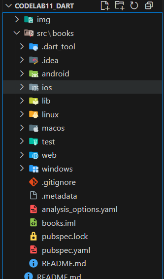

Tambahkan dependensi http
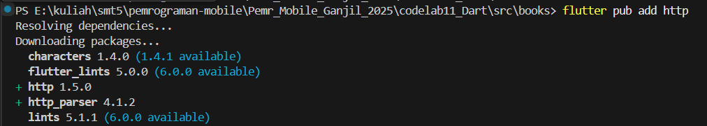

## Langkah 2: Cek file `pubspec.yaml`
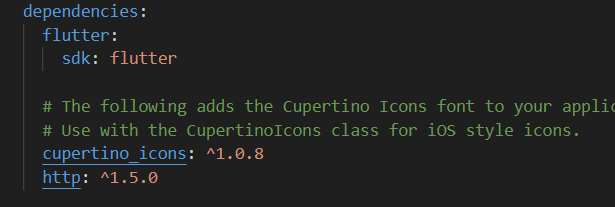

## Langkah 3: `main.dart`
**SOAL 1**
Nama Panggilan : Nisa
```dart
import 'dart:async';
import 'package:flutter/material.dart';
import 'package:http/http.dart';
import 'package:http/http.dart' as http;

void main() {
  runApp(const MyApp());
}

class MyApp extends StatelessWidget {
  const MyApp({super.key});

  @override
  Widget build(BuildContext context) {
    return MaterialApp(
      title: 'Future Demo by Nisa', 
      theme: ThemeData(
        primarySwatch: Colors.blue,
        visualDensity: VisualDensity.adaptivePlatformDensity,
      ),
      home: const FuturePage(),
    );
  }
}

class FuturePage extends StatefulWidget {
  const FuturePage({super.key});

  @override
  State<FuturePage> createState() => _FuturePageState();
}

class _FuturePageState extends State<FuturePage> {
  String result = '';

  @override
  Widget build(BuildContext context) {
    return Scaffold(
      appBar: AppBar(
        title: const Text('Back from the Future'),
      ),
      body: Center(
        child: Column(children: [
          const Spacer(),
          ElevatedButton(
            child: const Text('GO!'),
            onPressed: () {},
          ),
          const Spacer(),
          Text(result),
          const Spacer(),
          const CircularProgressIndicator(),
          const Spacer(),
        ]),
      ),
    );
  }
}
```

## Langkah 4: Tambah method getData()
**Soal 2: Kode buku** :


method:
```dart
  Future<Response> getData() async {
    const authority = 'www.googleapis.com';
    const path = '/books/v1/volumes/B1mxDwAAQBAJ'; 
    Uri url = Uri.https(authority, path);
    return http.get(url);
  }
```
**Hasil JSON**
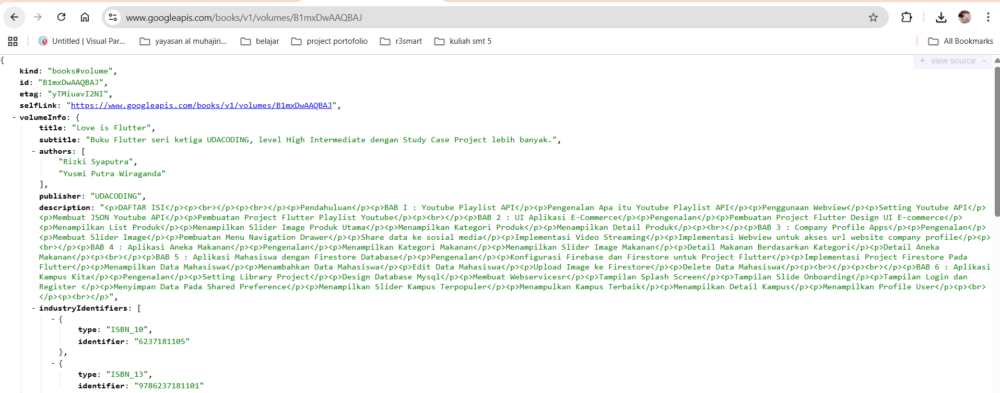

## Langkah 5: Tambah kode di ElevatedButton
```dart
ElevatedButton(
  child: Text('GO!'),
  onPressed: () {
    setState(() {});
    getData()
        .then((value) {
      result = value.body.toString().substring(0, 450);
      setState(() {});
    }).catchError((_) {
      result = 'An error occurred';
      setState(() {});
    });
  },
),
```

## Hasil
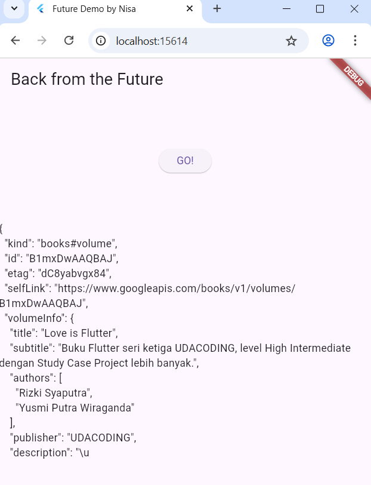

**Soal 3**
1.  Jelaskan maksud kode langkah 5 tersebut terkait substring dan catchError!
- `then((value) { ... })`
    Bagian ini akan dijalankan setelah permintaan HTTP berhasil diselesaikan.
    value di sini adalah Response dari http.get() yang berisi data JSON buku dari Google Books API.
- `substring(0, 450)`
    Kode ini memotong hasil JSON agar tidak terlalu panjang ketika ditampilkan di layar. Artinya hanya 450 karakter pertama dari value.body yang ditampilkan ke UI. Tanpa substring, teks JSON-nya bisa ribuan karakter dan bisa bikin tampilan UI overload atau lag
- `catchError((_) { ... })`
    Bagian ini menangani error ketika request gagal, misalnya: Tidak ada koneksi internet, URL API salah, Timeout atau status code 404. Jika terjadi error, teks yang ditampilkan di layar adalah "An error occurred".
- `setState(() {})`
    Dipanggil untuk memberi tahu Flutter bahwa ada data baru (result) sehingga UI perlu rebuild dan menampilkan hasil terkini.

2. Capture hasil praktikum Anda berupa GIF dan lampirkan di README. Lalu lakukan commit dengan pesan "W11: Soal 3".
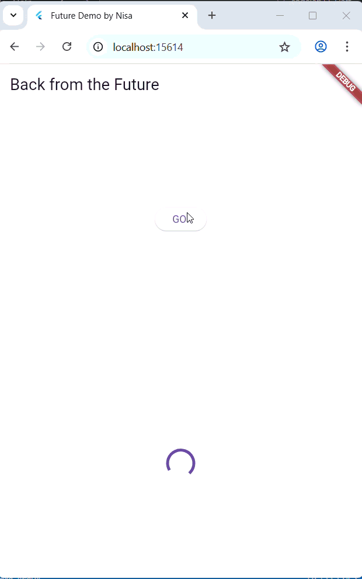

---

# Praktikum 2: Menggunakan await/async untuk menghindari callbacks
## langkah 1-3: Tambahkan method baru di `_FuturePageState`

```dart
class _FuturePageState extends State<FuturePage> {
  String result = '';
  Future<Response> getData() async {
    const authority = 'www.googleapis.com';
    const path = '/books/v1/volumes/B1mxDwAAQBAJ';
    Uri url = Uri.https(authority, path);
    return http.get(url);
  }

  Future<int> returnOneAsync() async {
    await Future.delayed(const Duration(seconds: 3));
    return 1;
  }

  Future<int> returnTwoAsync() async {
    await Future.delayed(const Duration(seconds: 3));
    return 2;
  }

  Future<int> returnThreeAsync() async {
    await Future.delayed(const Duration(seconds: 3));
    return 3;
  }

  Future count() async {
    int total = 0;
    total = await returnOneAsync();
    total += await returnTwoAsync();
    total += await returnThreeAsync();
    setState(() {
      result = total.toString();
    });
  }

  @override
  Widget build(BuildContext context) {
    return Scaffold(
      appBar: AppBar(title: const Text('Back from the Future')),
      body: Center(
        child: Column(
          children: [
            const Spacer(),
            ElevatedButton(
              child: const Text('GO!'),
              onPressed: () {
                count(); // memanggil fungsi asynchronous
              },
            ),

            const Spacer(),
            Text(result),
            const Spacer(),
            const CircularProgressIndicator(),
            const Spacer(),
          ],
        ),
      ),
    );
  }
}
```


**Soal 4**
1. Jelaskan maksud kode langkah 1 dan 2 tersebut!

    Ketiga method returnOneAsync(), returnTwoAsync(), dan returnThreeAsync() adalah fungsi asynchronous yang masing-masing menunggu selama 3 detik sebelum mengembalikan nilai 1, 2, dan 3.
    Fungsi count() menjalankan ketiga fungsi tersebut secara berurutan menggunakan await, sehingga total waktu tunda menjadi 9 detik. Setelah semua proses selesai, nilai total dijumlahkan dan ditampilkan ke layar melalui setState().
    Kode ini memperlihatkan bagaimana penggunaan async/await membuat kode asynchronous lebih sederhana, mudah dibaca, dan tetap menunggu hasil tiap proses sebelum lanjut ke berikutnya.


2. Capture hasil praktikum Anda berupa GIF dan lampirkan di README. Lalu lakukan commit dengan pesan "W11: Soal 4".
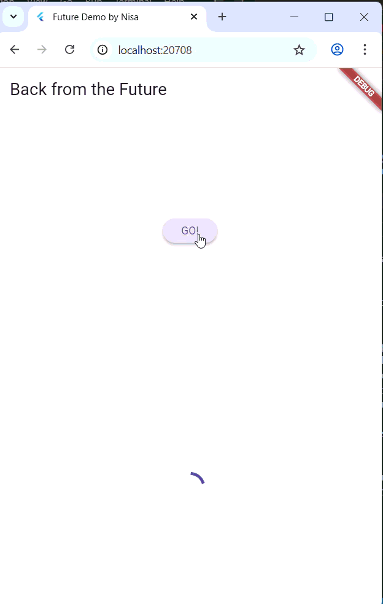


---

# Praktikum 3: Menggunakan Completer di Future
## Langkah 1-3: `main.dart`
```dart
import 'dart:async';
import 'package:flutter/material.dart';
import 'package:http/http.dart';
import 'package:http/http.dart' as http;
import 'package:async/async.dart';

...

class _FuturePageState extends State<FuturePage> {
  String result = '';

...

  late Completer completer;

  Future getNumber() {
    completer = Completer<int>();
    calculate();
    return completer.future;
  }

  Future calculate() async {
    await Future.delayed(const Duration(seconds: 5));
    completer.complete(42);
  }

  @override
  Widget build(BuildContext context) {
    return Scaffold(
      appBar: AppBar(title: const Text('Back from the Future')),
      body: Center(
        child: Column(
          children: [
            const Spacer(),
            ElevatedButton(
              child: const Text('GO!'),
              onPressed: () {
                getNumber().then((value) {
                  setState(() {
                    result = value.toString();
                  });
                });
              },
            ),
...
```
**Soal 5**
1. Jelaskan maksud kode langkah 2 tersebut!

    Pada langkah 2, digunakan class `Completer` untuk membuat `Future` yang dapat diselesaikan secara manual. Objek completer dibuat di dalam `getNumber()`, lalu dikembalikan sebagai `completer.future`.`Fungsi calculate()` mensimulasikan proses `asynchronous` dengan `Future.delayed()` selama 5 detik, kemudian memanggil `completer.complete(42)` untuk memberi nilai pada Future tersebut. Dengan kata lain, Completer memungkinkan kita menentukan kapan dan bagaimana Future dianggap “selesai”, bukan otomatis seperti pada async/await biasa. Setelah Future diselesaikan, then() akan dijalankan dan menampilkan nilai 42 di layar.

2. Capture hasil praktikum Anda berupa GIF dan lampirkan di README. Lalu lakukan commit dengan pesan "W11: Soal 5".
    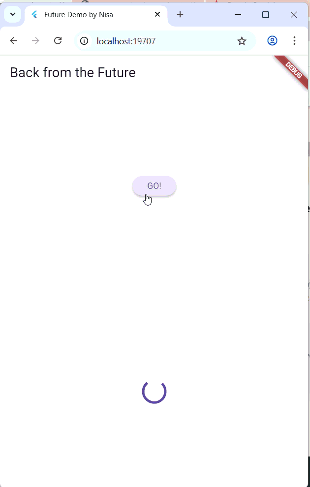


## Langkah 5-6: `main.dart`
```dart
  calculate() async {
    try {
      await new Future.delayed(const Duration(seconds: 5));
      completer.complete(42);

      // throw Exception();
    } catch (_) {
      completer.completeError({});
    }
  }

  @override
  Widget build(BuildContext context) {
    return Scaffold(
      appBar: AppBar(title: const Text('Back from the Future')),
      body: Center(
        child: Column(
          children: [
            const Spacer(),
            ElevatedButton(
              child: const Text('GO!'),
              onPressed: () {
                getNumber()
                    .then((value) {
                      setState(() {
                        result = value.toString();
                      });
                    })
                    .catchError((e) {
                      result = 'An error occurred';
                      setState(() {});
                    });
              },
            ),

            const Spacer(),
            Text(result),
            const Spacer(),
            const CircularProgressIndicator(),
            const Spacer(),
          ],
        ),
      ),
    );
  }
}
```
**Soal 6**
1. Jelaskan maksud perbedaan kode langkah 2 dengan langkah 5-6 tersebut!

    Perbedaan utama terletak pada penanganan error (exception).
Pada langkah 2, kode hanya menyelesaikan Completer dengan nilai sukses (completer.complete(42)), tanpa mempertimbangkan kemungkinan gagal. Jika terjadi error, Future tetap dianggap berhasil (meskipun logika salah).

    Sedangkan pada langkah 5–6, ditambahkan try-catch agar ketika terjadi error, program tidak crash, tetapi menyelesaikan Future dengan status error (completer.completeError({})).
Pada bagian onPressed(), kita menambahkan .catchError() untuk menampilkan pesan kesalahan di UI.

    Dengan demikian, versi langkah 5–6 lebih aman dan robust, karena dapat menangani baik hasil sukses maupun error secara terpisah dan jelas.

2. Capture hasil praktikum Anda berupa GIF dan lampirkan di README. Lalu lakukan commit dengan pesan "W11: Soal 6".
    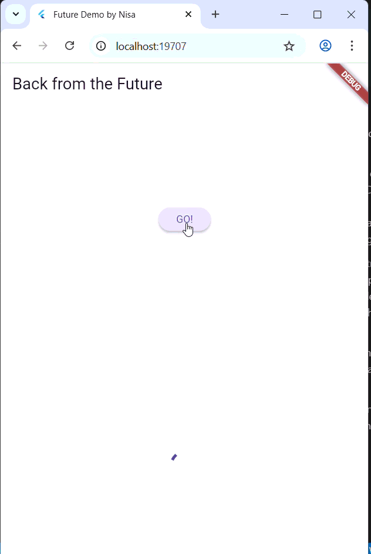

---

# Praktikum 4: Memanggil Future secara paralel
## Langkah 1-3: `main.dart`
```dart
...
  void returnFG() {
    FutureGroup<int> futureGroup = FutureGroup<int>();
    futureGroup.add(returnOneAsync());
    futureGroup.add(returnTwoAsync());
    futureGroup.add(returnThreeAsync());
    futureGroup.close();

    futureGroup.future.then(((List<int> value) {
      int total = 0;
      for (var element in value) {
        total += element;
      }
      setState(() {
        result = total.toString();
      });
    }));
  }

  ...

              ElevatedButton(
              child: const Text('GO!'),
              onPressed: () {
                returnFG();
              },
            ),
  ...
```

**Soal 7**
1. Capture hasil praktikum Anda berupa GIF dan lampirkan di README. Lalu lakukan commit dengan pesan "W11: Soal 7".
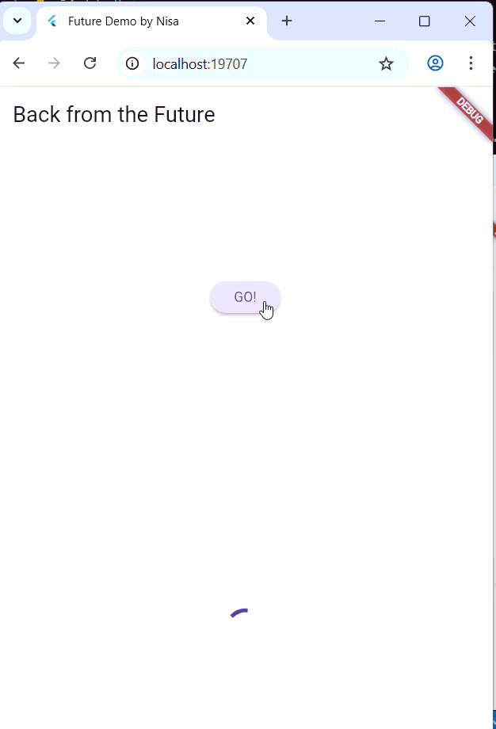
hasilnya dalam 3 detik berupa angka 6 lebih cepat dibandingkan praktikum sebelumnya menunggu sampai 9 detik.

## Langkah 4: `returnGf()`
```dart
void returnFG() {
  // Ganti FutureGroup dengan Future.wait
  final futures = Future.wait<int>([
    returnOneAsync(),
    returnTwoAsync(),
    returnThreeAsync(),
  ]);

  futures.then(((List<int> value) {
    int total = 0;
    for (var element in value) {
      total += element;
    }
    setState(() {
      result = total.toString();
    });
  }));
}
```

**Soal 8**
1. Jelaskan maksud perbedaan kode langkah 1 dan 4!

    `FutureGroup` digunakan untuk mengelola kumpulan Future secara dinamis — Future bisa ditambahkan satu per satu dan baru dijalankan setelah grup ditutup dengan `.close()`.
    
    Sementara `Future.wait` langsung menjalankan semua Future dalam sebuah list secara paralel tanpa perlu ditutup secara manual.

    Hasil akhirnya sama-sama mengembalikan List hasil dari seluruh Future, namun `Future.wait` lebih sederhana dan efisien jika daftar Future sudah pasti.

---

# Praktikum 5: Menangani Respon Error pada Async Code
## Langkah 1-3: `main.dart`
```dart
  Future returnError() async {
    await Future.delayed(const Duration(seconds: 2));
    throw Exception('Something terrible happened!');
  }

  @override
  Widget build(BuildContext context) {
    return Scaffold(
      appBar: AppBar(title: const Text('Back from the Future')),
      body: Center(
        child: Column(
          children: [
            const Spacer(),
            ElevatedButton(
              child: const Text('GO!'),
              onPressed: () {
                returnError()
                    .then((value) {
                      setState(() {
                        result = 'Success';
                      });
                    })
                    .catchError((onError) {
                      setState(() {
                        result = onError.toString();
                      });
                    })
                    .whenComplete(() => print('Complete'));
              },
            ),
```


**Soal 9**
1. Capture hasil praktikum Anda berupa GIF dan lampirkan di README. Lalu lakukan commit dengan pesan "W11: Soal 9".
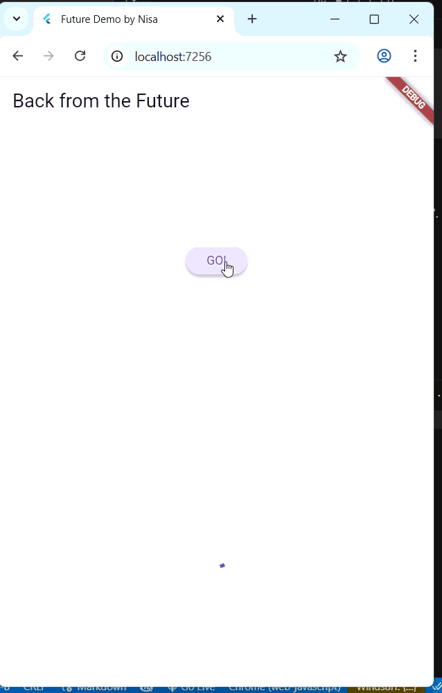

**Debug Console**
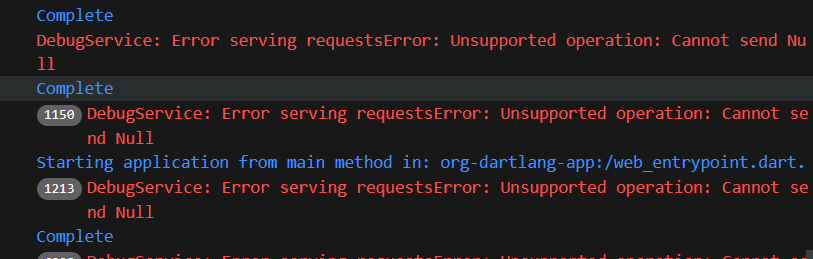


## Langkah 4: Tambah method handleError()
```dart

  Future handleError() async {
    try {
      await returnError();
    } catch (error) {
      setState(() {
        result = error.toString();
      });
    } finally {
      print('Complete');
    }
  }

  @override
  Widget build(BuildContext context) {
    return Scaffold(
      appBar: AppBar(title: const Text('Back from the Future')),
      body: Center(
        child: Column(
          children: [
            const Spacer(),
            ElevatedButton(
              child: const Text('GO!'),
              onPressed: () {
                handleError();
              },
            ),
```

**Soal 10**
Panggil method handleError() tersebut di ElevatedButton, lalu run. Apa hasilnya? Jelaskan perbedaan kode langkah 1 dan 4!

**Hasil**


**Debug Console**
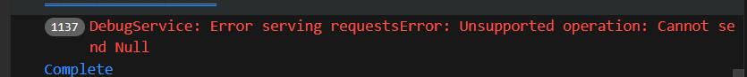

**Penjelasan**
Kode pada langkah 1 menggunakan pola callback (`then()`, `catchError`(), `whenComplete()`), sedangkan langkah 4 menggunakan pola `async`/`await` dengan `try-catch-finally`.
Hasilnya sama-sama menampilkan pesan error di UI dan teks “Complete” di console, namun pendekatan async/await (langkah 4) lebih mudah dibaca, ditulis, dan dikelola terutama untuk operasi asynchronous yang kompleks.

---

# Praktikum 6: Menggunakan Future dengan StatefulWidget
## Langkah 1: Install Plugin Geolocator


## Langkah 2: Tambah Permission GPS
`android/app/src/main/androidmanifest.xml`
```dart
<uses-permission android:name="android.permission.ACCESS_FINE_LOCATION"/>
<uses-permission android:name="android.permission.ACCESS_COARSE_LOCATION"/>
```

## Langkah 3-5: `lib/geolocation.dart`
```dart
import 'package:flutter/material.dart';
import 'package:geolocator/geolocator.dart';

class LocationScreen extends StatefulWidget {
  const LocationScreen({super.key});

  @override
  State<LocationScreen> createState() => _LocationScreenState();
}

class _LocationScreenState extends State<LocationScreen> {
  String myPosition = '';

  @override
  void initState() {
    super.initState();
    getPosition().then((Position myPos) {
      myPosition =
          'Latitude: ${myPos.latitude.toString()} - Longitude: ${myPos.longitude.toString()}';
      setState(() {
        myPosition = myPosition;
      });
    });
  }

  @override
  Widget build(BuildContext context) {
    return Scaffold(
      appBar: AppBar(title: const Text('Current Location Nisa')),
      body: Center(child: Text(myPosition)),
    );
  }

  Future<Position> getPosition() async {
    await Geolocator.requestPermission();
    Position? position = await Geolocator.getCurrentPosition();
    return position;
  }
}
```

**Soal 11** Panggilan : Nisa

## Langkah 6: `main.dart`:
```dart
  Widget build(BuildContext context) {
    return MaterialApp(
      title: 'Future Demo by Nisa',
      theme: ThemeData(
        primarySwatch: Colors.blue,
        visualDensity: VisualDensity.adaptivePlatformDensity,
      ),
      home: LocationScreen(),
    );
  }
```

## Langkah 7: Hasil
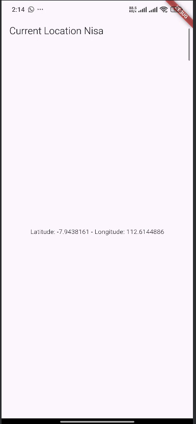

## Langkah 8: Tambahkan animasi loading
`lib/geolocation.dart`
```dart
  @override
  Widget build(BuildContext context) {
    final myWidget = myPosition == ''
        ? const CircularProgressIndicator()
        : Text(myPosition);

    return Scaffold(
      appBar: AppBar(title: Text('Current Location Nisa')),
      body: Center(child: myWidget),
    );
  }

  Future<Position> getPosition() async {
    await Geolocator.requestPermission();
    await Future.delayed(const Duration(seconds: 3));
    Position? position = await Geolocator.getCurrentPosition();
    return position;
  }
```

**Soal 12**
1. Jika Anda tidak melihat animasi loading tampil, kemungkinan itu berjalan sangat cepat. Tambahkan delay pada method getPosition() dengan kode await Future.delayed(const Duration(seconds: 3));
2. Apakah Anda mendapatkan koordinat GPS ketika run di browser? Mengapa demikian?
    **Run di browser**
    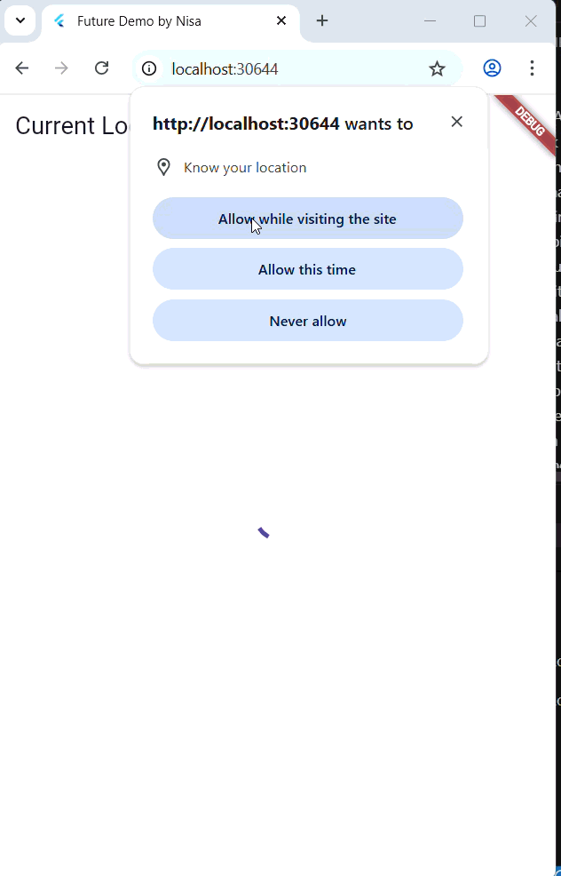
    Koordinat GPS dapat diperoleh di browser karena Flutter Web menggunakan API geolocation bawaan browser. Meski plugin Geolocator dibuat untuk Android/iOS, di Web ia tetap memanfaatkan navigator.geolocation sehingga lokasi bisa ditampilkan, meski akurasinya tergantung izin dan kemampuan browser.

3. Capture hasil praktikum Anda berupa GIF dan lampirkan di README. Lalu lakukan commit dengan pesan "W11: Soal 12".
  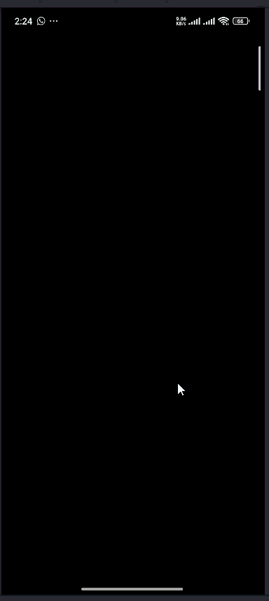

---

# Praktikum 7: Manajemen Future dengan FutureBuilder
## Langkah 1: `lib/geolocation.dart`
```dart
import 'package:flutter/material.dart';
import 'package:geolocator/geolocator.dart';

class LocationScreen extends StatefulWidget {
  const LocationScreen({super.key});

  @override
  State<LocationScreen> createState() => _LocationScreenState();
}

class _LocationScreenState extends State<LocationScreen> {
  Future<Position>? position;
  String myPosition = '';

  @override
  void initState() {
    super.initState();
    position = getPosition();
  }

  @override
  Widget build(BuildContext context) {
    return Scaffold(
      appBar: AppBar(title: Text('Current Location Nisa')),
      body: Center(
        child: FutureBuilder(
          future: position,
          builder: (BuildContext context, AsyncSnapshot<Position> snapshot) {
            if (snapshot.connectionState == ConnectionState.waiting) {
              return const CircularProgressIndicator();
            } else if (snapshot.connectionState == ConnectionState.done) {
              return Text(snapshot.data.toString());
            } else {
              return const Text('');
            }
          },
        ),
      ),
    );
  }

  Future<Position> getPosition() async {
    await Geolocator.isLocationServiceEnabled();
    await Future.delayed(const Duration(seconds: 3));
    Position position = await Geolocator.getCurrentPosition();
    return position;
  }
}

```

**Soal 13**
1. Apakah ada perbedaan UI dengan praktikum sebelumnya? Mengapa demikian?
    Perbedaan UI dengan praktikum sebelumnya terletak pada cara data ditampilkan. Sebelumnya menggunakan setState() untuk menunggu future selesai, sedangkan sekarang FutureBuilder secara otomatis membangun ulang widget ketika data tersedia. Akibatnya, animasi loading muncul hanya saat future berjalan, dan teks koordinat muncul langsung saat data diterima, tanpa perlu memanggil setState() secara manual.

2. Capture hasil praktikum Anda berupa GIF dan lampirkan di README. Lalu lakukan commit dengan pesan "W11: Soal 13".
    

3. Seperti yang Anda lihat, menggunakan FutureBuilder lebih efisien, clean, dan reactive dengan Future bersama UI.

## Langkah 5: Tambah Handling Error
```dart
        child: FutureBuilder(
          future: position,
          builder: (BuildContext context, AsyncSnapshot<Position> snapshot) {
            if (snapshot.connectionState == ConnectionState.waiting) {
              return const CircularProgressIndicator();
            } else if (snapshot.connectionState == ConnectionState.done) {
              if (snapshot.hasError) {
                return const Text('Something terrible happened!');
              }
              return Text(snapshot.data.toString());
            } else {
              return const Text('');
            }
          },
        ),
```

**Soal 14**
1. Apakah ada perbedaan UI dengan langkah sebelumnya? Mengapa demikian?
    Perbedaan UI setelah menambahkan error handling adalah seharusnya ketika terjadi kesalahan, aplikasi menampilkan pesan 'Something terrible happened!' alih-alih kosong atau error default. UI lainnya tetap sama

2. Capture hasil praktikum Anda berupa GIF dan lampirkan di README. Lalu lakukan commit dengan pesan "W11: Soal 14".
    

---

# Praktikum 8: Navigation route dengan Future Function
## Langkah 1-3: `lib/navigation_first.dart`
```dart
import 'package:books/navigation_second.dart';
import 'package:flutter/material.dart';

class NavigationFirst extends StatefulWidget {
  const NavigationFirst({super.key});

  @override
  State<NavigationFirst> createState() => _NavigationFirstState();
}

class _NavigationFirstState extends State<NavigationFirst> {
  Color color = Colors.blue.shade700;

  @override
  Widget build(BuildContext context) {
    return Scaffold(
      backgroundColor: color,
      appBar: AppBar(title: const Text('Navigation First Screen Nisa')),
      body: Center(
        child: ElevatedButton(
          child: const Text('Change Color'),
          onPressed: () {
            _navigateAndGetColor(context);
          },
        ),
      ),
    );
  }

  Future _navigateAndGetColor(BuildContext context) async {
    color =
        await Navigator.push(
          context,
          MaterialPageRoute(builder: (context) => const NavigationSecond()),
        ) ??
        Colors.blue;
    setState(() {});
  }
}
```
## langkah 4-5: `lib/navigation_second.dart`
```dart
import 'package:flutter/material.dart';

class NavigationSecond extends StatefulWidget {
  const NavigationSecond({super.key});

  @override
  State<NavigationSecond> createState() => _NavigationSecondState();
}

class _NavigationSecondState extends State<NavigationSecond> {
  @override
  Widget build(BuildContext context) {
    Color color;
    return Scaffold(
      appBar: AppBar(
        title: const Text('Navigation Second Screen'),
      ),
      body: Center(
        child: Column(
          mainAxisAlignment: MainAxisAlignment.spaceEvenly,
          children: [
            ElevatedButton(
              child: const Text('Red'),
              onPressed: () {
                color = Colors.red.shade700;
                Navigator.pop(context, color);
              },
            ),
            ElevatedButton(
              child: const Text('Green'),
              onPressed: () {
                color = Colors.green.shade700;
                Navigator.pop(context, color);
              },
            ),
            ElevatedButton(
              child: const Text('Blue'),
              onPressed: () {
                color = Colors.blue.shade700;
                Navigator.pop(context, color);
              },
            ),
          ],
        ),
      ),
    );
  }
}
```

## Langkah 6: `lib/main.dart`
```dart
      home: const NavigationFirst(),
```

**Soal 16**
- Cobalah klik setiap button, apa yang terjadi ? Mengapa demikian ? 
    
    Setiap kali menekan tombol di NavigationSecond, warna background pada NavigationFirst berubah sesuai warna yang dipilih. Hal ini terjadi karena Navigator menunggu hasil dari Navigator.pop(context, color) menggunakan await, lalu setelah nilai dikembalikan (selectedColor), method setState() dipanggil untuk memperbarui UI. Pola ini memanfaatkan Future untuk komunikasi antar route secara asinkron.

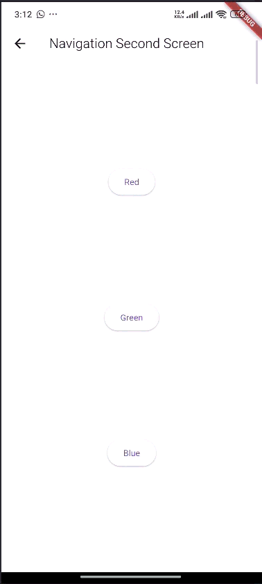

---

# Praktikum 9: Memanfaatkan async/await dengan Widget Dialog
## Langkah 1-4: `lib/navigation_dialog.dart`
```dart
import 'package:flutter/material.dart';

class NavigationDialogScreen extends StatefulWidget {
  const NavigationDialogScreen({super.key});

  @override
  State<NavigationDialogScreen> createState() => _NavigationDialogScreenState();
}

class _NavigationDialogScreenState extends State<NavigationDialogScreen> {
  Color color = Colors.blue.shade700;

  @override
  Widget build(BuildContext context) {
    return Scaffold(
      backgroundColor: color,
      appBar: AppBar(
        title: const Text('Navigation Dialog Screen Nisa'),
      ),
      body: Center(
        child: ElevatedButton(
          child: const Text('Change Color'),
          onPressed: () {
            _showColorDialog(context);
          },
        ),
      ),
    );
  }

  Future<void> _showColorDialog(BuildContext context) async {
    final selectedColor = await showDialog<Color>(
      barrierDismissible: false,
      context: context,
      builder: (_) {
        return AlertDialog(
          title: const Text('Very important question'),
          content: const Text('Please choose a color'),
          actions: <Widget>[
            TextButton(
              child: const Text('Red'),
              onPressed: () {
                Navigator.pop(context, Colors.red.shade700);
              },
            ),
            TextButton(
              child: const Text('Green'),
              onPressed: () {
                Navigator.pop(context, Colors.green.shade700);
              },
            ),
            TextButton(
              child: const Text('Blue'),
              onPressed: () {
                Navigator.pop(context, Colors.blue.shade700);
              },
            ),
          ],
        );
      },
    );

    if (selectedColor != null) {
      setState(() {
        color = selectedColor;
      });
    }
  }
}

```

## Langkah 5: `lib/main.dart`
```dart
      home: const NavigationDialogScreen(),
```

**Soal 17**

Cobalah klik setiap button, apa yang terjadi ? Mengapa demikian ?

Ketika salah satu button diklik, warna background `Scaffold` berubah sesuai warna yang dipilih. Hal ini terjadi karena:
- Dialog (`AlertDialog`) menunggu input pengguna dengan `await showDialog`.
- Setelah pengguna memilih warna, dialog menutup (Navigator.pop) dan mengembalikan nilai warna yang dipilih.
- `setState` kemudian dipanggil untuk memperbarui color pada widget, sehingga UI menampilkan warna baru secara real-time.

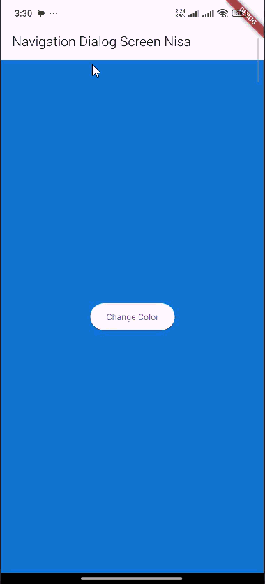