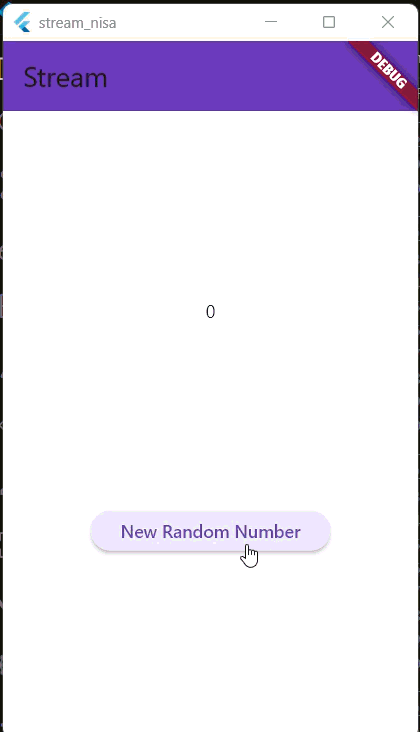
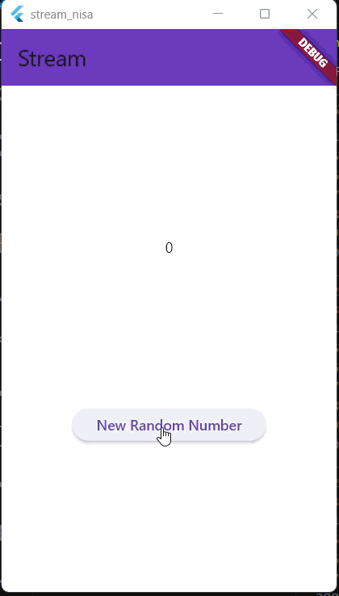
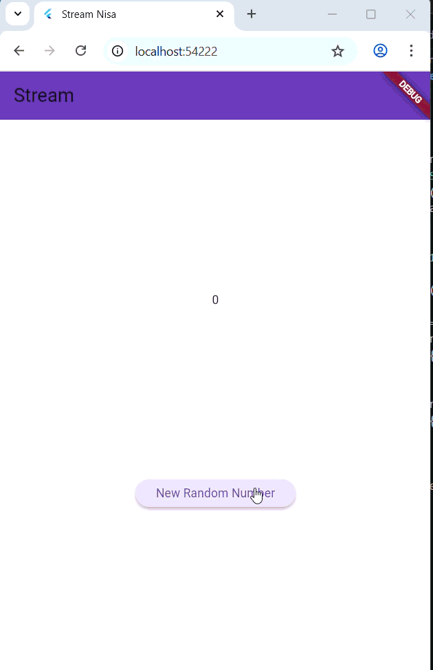
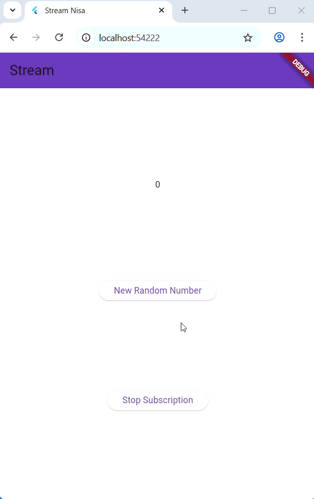
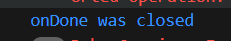
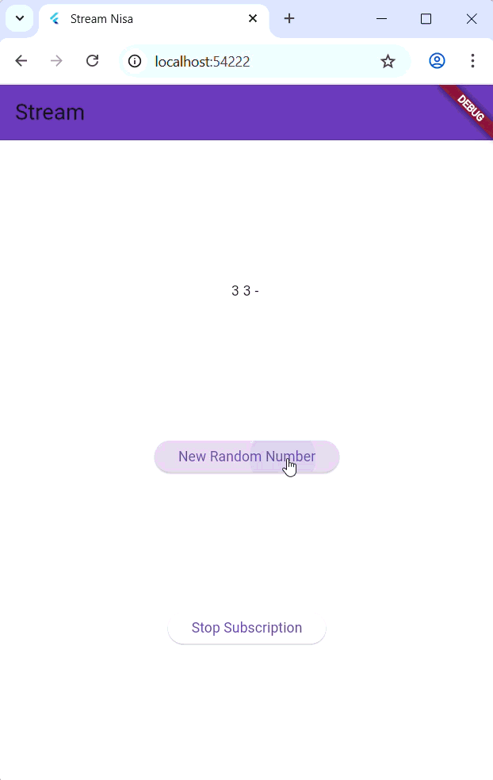
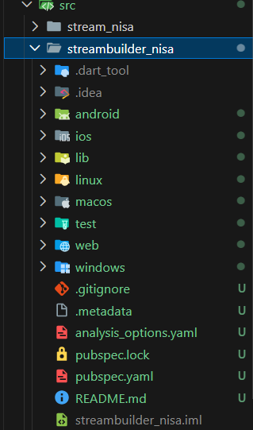
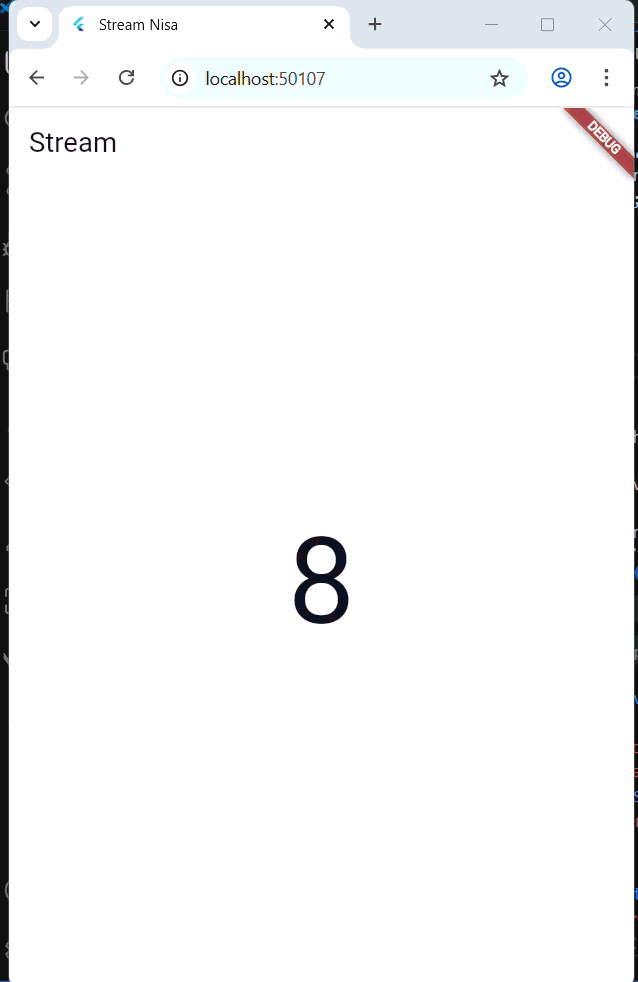
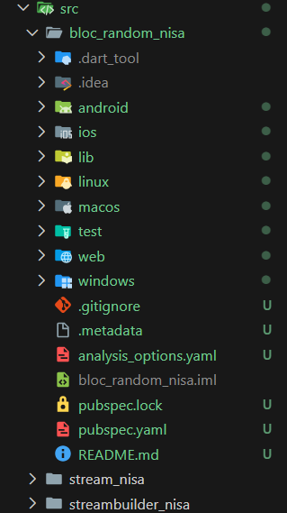
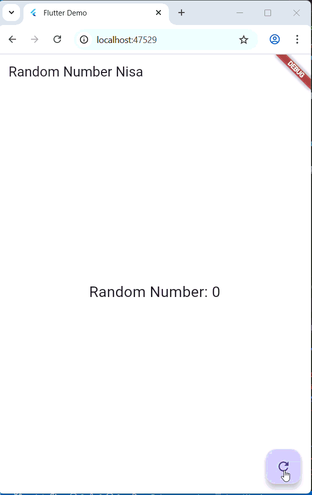

# Praktikum Codelab_12: Lanjutan State Management dengan Streams

| Absen | NIM        | Nama            |
|-------|------------|-----------------|
| 18    | 2341720057 | Khoirotun Nisa' |

---

# Praktikum 1: Dart Streams

## Langkah 1: Buat Project Baru


## Langkah 2-6
**`main.dart`**
```dart
import 'package:flutter/material.dart';

void main() {
  runApp(const MyApp());
}

class MyApp extends StatelessWidget {
  const MyApp({super.key});

  @override
  Widget build(BuildContext context) {
    return MaterialApp(
      title: 'Stream Nisa', // soal 1
      theme: ThemeData(
        primarySwatch: Colors.deepPurple,
      ),
      home: const StreamHomePage(),
    );
  }
}

class StreamHomePage extends StatefulWidget {
  const StreamHomePage({super.key});

  @override
  State<StreamHomePage> createState() => _StreamHomePageState();
}

class _StreamHomePageState extends State<StreamHomePage> {
  @override
  Widget build(BuildContext context) {
    return Container();
  }
}
```

**`stream.dart`**
```dart
import 'package:flutter/material.dart';

class ColorStream {
  final List<Color> colors = [
    Colors.blueGrey,
    Colors.amber,
    Colors.deepPurple,
    Colors.lightBlue,
    Colors.teal,
    // Soal 2
    Colors.red,
    Colors.green,
    Colors.orange,
    Colors.indigo,
    Colors.pink,
  ];

  Stream<Color> getColors() async* {
    yield* Stream.periodic(const Duration(seconds: 1), (int t) {
      int index = t % colors.length;
      return colors[index];
    });
  }
}
```

**Soal 3**
1. Jelaskan fungsi keyword yield* pada kode tersebut!
    
    `yield*` digunakan untuk menghasilkan nilai dari stream lain secara langsung. `yield*` mengambil seluruh output dari Stream lain dan meneruskannya ke Stream yang sedang berjalan.
2. Apa maksud isi perintah kode tersebut?

    Kode tersebut membuat stream yang:
    - Mengirim satu warna setiap 1 detik
    - Warna diambil dari list colors
    - Loop warna terus-menerus dengan rumus `index = t % jumlah_warna`

## Langkah 7 - 12
`main.dart
```dart
import 'package:flutter/material.dart';
import 'stream.dart';
...

class _StreamHomePageState extends State<StreamHomePage> {
  Color bgColor = Colors.blueGrey;
  late ColorStream colorStream;
  void changeColor() async {
    await for (var eventColor in colorStream.getColors()) {
      setState(() {
        bgColor = eventColor;
      });
    }
  }
  
  @override
  void initState() {
    super.initState();
    colorStream = ColorStream();
    changeColor();
  }
  @override
  Widget build(BuildContext context) {
    return Scaffold(
      appBar: AppBar(
        title: const Text('Stream'),
        backgroundColor: Colors.deepPurple,
      ),
      body: Container(
        decoration: BoxDecoration(
          color: bgColor,
        ),
      ),
    );
  }
}

```

**Soal 4**


## Langkah 13
```dart
class _StreamHomePageState extends State<StreamHomePage> {
  Color bgColor = Colors.blueGrey;
  late ColorStream colorStream;
  void changeColor() {
    colorStream.getColors().listen((eventColor) {
      setState(() {
        bgColor = eventColor;
      });
    });
  }
```
**Hasil**


**Soal 5**
Jelaskan perbedaan menggunakan listen dan await for (langkah 9) !

- `listen` : Berjalan sebagai callback yang tidak menghalangi eksekusi program. Stream berjalan di “samping”, dan setiap event dipanggil lewat listener. Cocok untuk UI, reaktif, dan tidak butuh blocking.
- `await for` : Menunggu event stream satu per satu secara synchronous dalam konteks async. Eksekusi akan menunggu sampai stream mengirim event berikutnya. Cocok bila ingin pemrosesan berurutan dan blocking di dalam fungsi async.

---

# Praktikum 2: Stream controllers dan sinks
## Langkah 1-12
**Kode**
`main.dart`
```dart
class _StreamHomePageState extends State<StreamHomePage> {
  Color bgColor = Colors.blueGrey;
  late ColorStream colorStream;
  int lastNumber = 0;
  late StreamController numberStreamController;
  late NumberStream numberStream;

  void changeColor() {
    colorStream.getColors().listen((eventColor) {
      setState(() {
        bgColor = eventColor;
      });
    });
  }

  void addRandomNumber() {
    Random random = Random();
    int myNum = random.nextInt(10);
    numberStream.addNumberToSink(myNum);
  }

  @override
  void initState() {
    numberStream = NumberStream();
    numberStreamController = numberStream.controller;
    Stream stream = numberStreamController.stream;
    stream.listen((event) {
      setState(() {
        lastNumber = event;
      });
    });
    super.initState();
  }

  @override
  void dispose() {
    numberStreamController.close();
    super.dispose();
  }

  @override
  Widget build(BuildContext context) {
    return Scaffold(
      appBar: AppBar(
        title: const Text('Stream'),
        backgroundColor: Colors.deepPurple,
      ),
      body: SizedBox(
        width: double.infinity,
        child: Column(
          mainAxisAlignment: MainAxisAlignment.spaceEvenly,
          crossAxisAlignment: CrossAxisAlignment.center,
          children: [
            Text(lastNumber.toString()),
            ElevatedButton(
              onPressed: () => addRandomNumber(),
              child: Text('New Random Number'),
            ),
          ],
        ),
      ),
    );
  }
}
```

`stream.dart`
```dart
class NumberStream {
  final StreamController<int> controller = StreamController<int>();
  
  void addNumberToSink(int newNumber) {
    controller.sink.add(newNumber);
  }

  close(){
    controller.close();
  }
}
```

**Soal**
Jelaskan maksud kode langkah 8 dan 10 tersebut!
- Kode pada langkah 8 tersebut membuat stream angka, lalu langsung menghubungkannya dengan UI. Controller diambil untuk mendapatkan aliran datanya, kemudian stream tersebut dipantau dengan `listen`. Setiap kali stream mengirim angka baru, nilai `lastNumber` diperbarui melalui `setState`, sehingga tampilan ikut berubah secara otomatis mengikuti data yang masuk.
- Method pada langkah 10 tersebut akan membuat sebuah angka acak 0–9 menggunakan `Random`, lalu mengirimkan angka tersebut ke stream melalui `addNumberToSink()`. Jadi setiap kali method ini dipanggil, stream akan menerima angka baru yang dihasilkan secara acak.

**Hasil**


## Langkah 13-15
`stream.dart`
```dart
  addError() {
    controller.sink.addError("Error");
  }
```
`main.dart`
```dart
  void addRandomNumber() {
    Random random = Random();
    // int myNum = random.nextInt(10);
    // numberStream.addNumberToSink(myNum);
    numberStream.addError();
  }
  ...

  @override
  void initState() {
    numberStream = NumberStream();
    numberStreamController = numberStream.controller;
    Stream stream = numberStreamController.stream;
    stream.listen((event) {
      setState(() {
        lastNumber = event;
      });
    }).onError((error) {
      setState(() {
        lastNumber = -1;
      });
    });
    super.initState();
  }
```

**Soal7**
Jelaskan maksud kode langkah 13 sampai 15 tersebut!
- Menambahkan method addError() yang memasukkan error ke stream lewat controller.sink.addError(). Hal ini akan membuat stream memancarkan event error, bukan angka.
- Pada listen, ditambah handler onError. Ketika stream mengirim error, UI tidak crash, tetapi lastNumber diubah menjadi -1 sebagai tanda bahwa terjadi error.
- Method addRandomNumber() diubah supaya tidak lagi mengirim angka acak, tetapi memicu error dengan memanggil addError().

Hasil akhirnya: setiap tombol/aksi yang memanggil method ini akan mengirim error ke stream, dan UI akan merespons dengan menampilkan nilai -1.

**Hasil**


---

# Praktikum 3: Injeksi data ke streams
`main.dart`
```dart
class _StreamHomePageState extends State<StreamHomePage> {
...
  late StreamTransformer transformer;

...

  @override
  void initState() {
    numberStream = NumberStream();
    numberStreamController = numberStream.controller;
    transformer = StreamTransformer<int, int>.fromHandlers(
      handleData: (value, sink) {
        sink.add(value * 10);
      },
      handleError: (error, trace, sink) {
        sink.add(-1);
      },
      handleDone: (sink) => sink.close(),
    );
    Stream stream = numberStreamController.stream;
    stream.transform(transformer).listen((event) {
      setState(() {
        lastNumber = event;
      });
    }).onError((error) {
      setState(() {
        lastNumber = -1;
      });
    });
    super.initState();
  }
```

**Soal 8**
Langkah 1–3 menambahkan sebuah `StreamTransformer` sebagai perantara sebelum data stream sampai ke UI. Transformer ini mengubah setiap angka yang masuk menjadi *nilai × 10*, dan jika muncul error, transformer menggantinya dengan `-1` agar UI tetap menerima data yang aman. Setelah itu, stream dijalankan melalui transformer menggunakan `stream.transform(transformer)`, sehingga listener hanya menerima data yang sudah diproses. Hasil akhirnya: UI selalu mendapatkan nilai yang sudah dimodifikasi dan tidak pernah menerima error mentah dari stream.


**Hasil**


---

# Praktikum 4: Subscribe ke stream events
## Langkah 1-10
`main.dart`
```dart
...

class _StreamHomePageState extends State<StreamHomePage> {
...
  late StreamSubscription subscription;

...

  void addRandomNumber() {
    Random random = Random();
    int myNum = random.nextInt(10);

    if (!numberStreamController.isClosed) {
      numberStream.addNumberToSink(myNum);
    } else {
      setState(() {
        lastNumber = -1;
      });
    }
  }

  @override
  void initState() {
    numberStream = NumberStream();
    numberStreamController = numberStream.controller;
    Stream stream = numberStreamController.stream;
    subscription = stream.listen((event) {
      setState(() {
        lastNumber = event;
      });
    });
    subscription.onError((error) {
      setState(() {
        lastNumber = -1;
      });
    });
    subscription.onDone(() {
      print("onDone was closed");
    });
    super.initState();
  }

  void stopStream() {
    numberStreamController.close();
  }

  @override
  void dispose() {
    subscription.cancel();
    numberStreamController.close();
    super.dispose();
  }

  @override
  Widget build(BuildContext context) {
    return Scaffold(
      ...
            ElevatedButton(
              onPressed: () => stopStream(),
              child: const Text('Stop Subscription'),
            ),
          ],
        ),
      ),
    );
  }
}
```

**Soal 9**
- Langkah 2 membuat listener stream disimpan dalam subscription, sehingga aliran data bisa dikontrol dan tetap memperbarui UI setiap ada angka masuk.
- Langkah 6 membatalkan subscription saat widget dibuang, supaya listener berhenti dan tidak memicu event setelah UI sudah tidak aktif.
- Langkah 8 memastikan stream masih terbuka sebelum mengirim angka. Jika stream sudah ditutup, UI hanya menampilkan -1 agar tidak terjadi error pengiriman data.

**Hasil**


**Console**


---

# Praktikum 5: Multiple stream subscriptions
## Langkah 1-3
`main.dart`
```dart
  late StreamSubscription subscription2;
  String values = '';
...
    subscription = stream.listen((event) {
      setState(() {
        values += '$event ';
      });
    });
    subscription2 = stream.listen((event) {
      setState(() {
        values += '$event - ';
      });
    });
    subscription.onDone(() {
      print("onDone was closed");
    });
    super.initState();
  }
```

**Hasil**


**Soal 10**
Error itu muncul karena satu stream yang sama didengar oleh dua listener berbeda, sementara stream yang dipakai adalah single-subscription stream (default di Dart).

Single-subscription stream hanya boleh punya satu pendengar.
Ketika listener kedua (`subscription2`) mencoba mendengarkan stream yang sama, Flutter langsung melempar error karena stream itu sudah “dikunci” untuk listener pertama.

## Langkah 4-6
`main.dart`
```dart
  void initState() {
    numberStream = NumberStream();
    numberStreamController = numberStream.controller;
    Stream stream = numberStreamController.stream.asBroadcastStream();
    subscription = stream.listen((event) {
...

  @override
  Widget build(BuildContext context) {
    return Scaffold(
      ...
          children: [
            Text(values),
```

**Hasil**


**Soal 11**

Hal itu terjadi karena stream yang semula hanya bisa didengarkan satu kali kini diubah menjadi broadcast stream. Setelah menjadi broadcast, kedua listener yang kamu pasang menerima event yang sama secara bersamaan. Setiap angka baru yang dikirim stream langsung diproses dua kali, sehingga teks pada layar juga bertambah dua kali setiap kali tombol ditekan.

---

# Praktikum 6: StreamBuilder
## Project baru


`main.dart`
```dart
import 'package:flutter/material.dart';
import 'stream.dart';
import 'dart:async';

void main() {
  runApp(const MyApp());
}

class MyApp extends StatelessWidget {
  const MyApp({super.key});

  @override
  Widget build(BuildContext context) {
    return MaterialApp(
      title: 'Stream Nisa',
      theme: ThemeData(primarySwatch: Colors.deepPurple),
      home: const StreamHomePage(),
    );
  }
}

class StreamHomePage extends StatefulWidget {
  const StreamHomePage({super.key});

  @override
  State<StreamHomePage> createState() => _StreamHomePageState();
}

class _StreamHomePageState extends State<StreamHomePage> {
  late Stream<int> numberStream;
  @override
  void initState() {
    numberStream = NumberStream().getNumbers();
    super.initState();
  }

  @override
  Widget build(BuildContext context) {
    return Scaffold(
      appBar: AppBar(title: const Text('Stream')),
      body: StreamBuilder(
        stream: numberStream,
        initialData: 0,
        builder: (context, snapshot) {
          if (snapshot.hasError) {
            print('Error!');
          }

          if (snapshot.hasData) {
            return Center(
              child: Text(
                snapshot.data.toString(),
                style: const TextStyle(fontSize: 96),
              ),
            );
          } else {
            return const SizedBox.shrink();
          }
        },
      ),
    );
  }
}
```

`stream.dart`
```dart
import 'dart:math';

class NumberStream {
  Stream<int> getNumbers() async* {
    yield* Stream.periodic(const Duration(seconds: 1), (int t) {
      Random random = Random();
      int myNum = random.nextInt(10);
      return myNum;
    });
  }
}
```

**Hasil**


**Soal 12**
- Kode pada langkah 3 membuat sebuah stream yang setiap 1 detik menghasilkan angka acak dari 0–9. Stream.periodic dipakai sebagai “mesin penghasil event,” dan yield* menyalurkan setiap angka yang dihasilkan ke luar sebagai event stream. Intinya, method getNumbers() adalah generator angka acak yang memancarkan data baru secara berkala.
- Kode pada langkah 7, StreamBuilder dipasang di UI untuk memantau stream tersebut. Setiap kali stream mengirim angka baru, StreamBuilder otomatis membangun ulang widget dan menampilkan angka tersebut di layar dengan ukuran besar. Jika stream mengirim error, ditangani lewat snapshot.hasError. Jika ada data, angka ditampilkan; kalau belum ada apa-apa, UI hanya kosong.

---

# Praktikum 7: BLoC Pattern
**Project Baru**


`main.dart`
```dart
import 'package:flutter/material.dart';
import 'random_screen.dart';

void main() {
  runApp(const MyApp());
}

class MyApp extends StatelessWidget {
  const MyApp({super.key});

  @override
  Widget build(BuildContext context) {
    return MaterialApp(
      title: 'Flutter Demo',
      theme: ThemeData(
        primarySwatch: Colors.blue,
      ),
      home: const RandomScreen(),
    );
  }
}
```

`random_bloc.dart`
```dart
import 'dart:async';
import 'dart:math';

class RandomNumberBloc {
  // StreamController for input events
  final _generateRandomController = StreamController<void>();
  // StreamController for output
  final _randomNumberController = StreamController<int>();
  // Input Sink
  Sink<void> get generateRandom => _generateRandomController.sink;
  // Output Stream.
  Stream<int> get randomNumber => _randomNumberController.stream;

  RandomNumberBloc() {
    _generateRandomController.stream.listen((_) {
      final random = Random().nextInt(10);
      _randomNumberController.sink.add(random);
    });
  }

  void dispose() {
    _generateRandomController.close();
    _randomNumberController.close();
  }
}

```

`random_screen.dart`
```dart
import 'package:flutter/material.dart';
import 'random_bloc.dart';

class RandomScreen extends StatefulWidget {
  const RandomScreen({Key? key}) : super(key: key);

  @override
  State<RandomScreen> createState() => _RandomScreenState();
}

class _RandomScreenState extends State<RandomScreen> {
  final _bloc = RandomNumberBloc();

  @override
  void dispose() {
    _bloc.dispose();
    super.dispose();
  }

  @override
  Widget build(BuildContext context) {
    return Scaffold(
      appBar: AppBar(title: const Text('Random Number Nisa')),
      body: Center(
        child: StreamBuilder<int>(
          stream: _bloc.randomNumber,
          initialData: 0,
          builder: (context, snapshot) {
            return Text(
              'Random Number: ${snapshot.data}',
              style: const TextStyle(fontSize: 24),
            );
          },
        ),
      ),
      floatingActionButton: FloatingActionButton(
        onPressed: () => _bloc.generateRandom.add(null),
        child: const Icon(Icons.refresh),
      ),
    );
  }
}

```

**Hasil**


**Soal 13**

Praktikum ini intinya akan mengenalkan pola arsitektur BLoC (Business Logic Component) di Flutter, yaitu cara memisahkan logika aplikasi dari UI dengan memakai Stream, Sink, dan StreamController.

Konsep BLoC terlihat jelas di file `random_bloc.dart`.
Di sana logika bisnis berada di luar widget, yaitu:

* Input event ditampung melalui sink (`generateRandom`)
* Proses bisnis terjadi di dalam BLoC (menghasilkan angka acak)
* Output dikirim melalui stream (`randomNumber`)
* UI hanya mendengarkan stream tanpa tahu logikanya

Widget `RandomScreen` tidak memproses angka, tidak membuat random number, tidak melakukan perhitungan, UI hanya menampilkan data dari BLoC. Sementara BLoC mengatur aliran data dan logikanya lewat StreamController.

