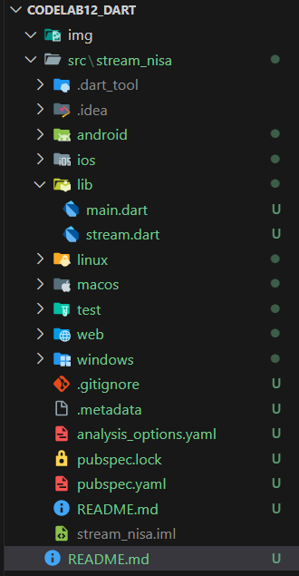
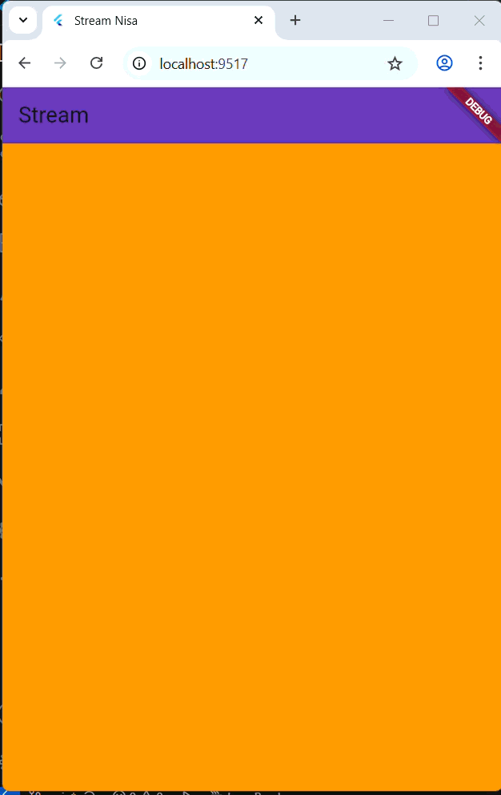
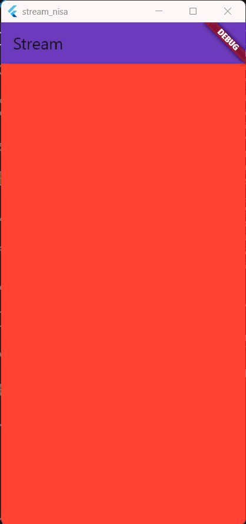

# Praktikum Codelab_12: Lanjutan State Management dengan Streams

| Absen | NIM        | Nama            |
|-------|------------|-----------------|
| 18    | 2341720057 | Khoirotun Nisa' |

---

# Praktikum 1: Dart Streams

## Langkah 1: Buat Project Baru


## Langkah 2-6
**`main.dart`**
```dart
import 'package:flutter/material.dart';

void main() {
  runApp(const MyApp());
}

class MyApp extends StatelessWidget {
  const MyApp({super.key});

  @override
  Widget build(BuildContext context) {
    return MaterialApp(
      title: 'Stream Nisa', // soal 1
      theme: ThemeData(
        primarySwatch: Colors.deepPurple,
      ),
      home: const StreamHomePage(),
    );
  }
}

class StreamHomePage extends StatefulWidget {
  const StreamHomePage({super.key});

  @override
  State<StreamHomePage> createState() => _StreamHomePageState();
}

class _StreamHomePageState extends State<StreamHomePage> {
  @override
  Widget build(BuildContext context) {
    return Container();
  }
}
```

**`stream.dart`**
```dart
import 'package:flutter/material.dart';

class ColorStream {
  final List<Color> colors = [
    Colors.blueGrey,
    Colors.amber,
    Colors.deepPurple,
    Colors.lightBlue,
    Colors.teal,
    // Soal 2
    Colors.red,
    Colors.green,
    Colors.orange,
    Colors.indigo,
    Colors.pink,
  ];

  Stream<Color> getColors() async* {
    yield* Stream.periodic(const Duration(seconds: 1), (int t) {
      int index = t % colors.length;
      return colors[index];
    });
  }
}
```

**Soal 3**
1. Jelaskan fungsi keyword yield* pada kode tersebut!
    
    `yield*` digunakan untuk menghasilkan nilai dari stream lain secara langsung. `yield*` mengambil seluruh output dari Stream lain dan meneruskannya ke Stream yang sedang berjalan.
2. Apa maksud isi perintah kode tersebut?

    Kode tersebut membuat stream yang:
    - Mengirim satu warna setiap 1 detik
    - Warna diambil dari list colors
    - Loop warna terus-menerus dengan rumus `index = t % jumlah_warna`

## Langkah 7 - 12
`main.dart
```dart
import 'package:flutter/material.dart';
import 'stream.dart';
...

class _StreamHomePageState extends State<StreamHomePage> {
  Color bgColor = Colors.blueGrey;
  late ColorStream colorStream;
  void changeColor() async {
    await for (var eventColor in colorStream.getColors()) {
      setState(() {
        bgColor = eventColor;
      });
    }
  }
  
  @override
  void initState() {
    super.initState();
    colorStream = ColorStream();
    changeColor();
  }
  @override
  Widget build(BuildContext context) {
    return Scaffold(
      appBar: AppBar(
        title: const Text('Stream'),
        backgroundColor: Colors.deepPurple,
      ),
      body: Container(
        decoration: BoxDecoration(
          color: bgColor,
        ),
      ),
    );
  }
}

```

**Soal 4**


## Langkah 13
```dart
class _StreamHomePageState extends State<StreamHomePage> {
  Color bgColor = Colors.blueGrey;
  late ColorStream colorStream;
  void changeColor() {
    colorStream.getColors().listen((eventColor) {
      setState(() {
        bgColor = eventColor;
      });
    });
  }
```
**Hasil**


**Soal 5**
Jelaskan perbedaan menggunakan listen dan await for (langkah 9) !

- `listen` : Berjalan sebagai callback yang tidak menghalangi eksekusi program. Stream berjalan di “samping”, dan setiap event dipanggil lewat listener. Cocok untuk UI, reaktif, dan tidak butuh blocking.
- `await for` : Menunggu event stream satu per satu secara synchronous dalam konteks async. Eksekusi akan menunggu sampai stream mengirim event berikutnya. Cocok bila ingin pemrosesan berurutan dan blocking di dalam fungsi async.