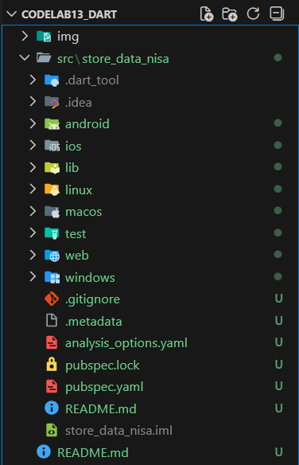
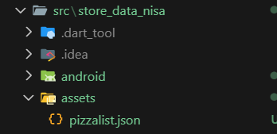
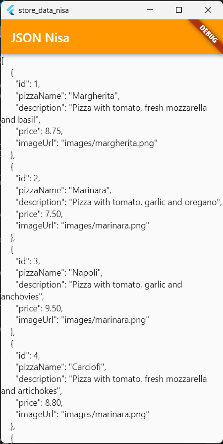
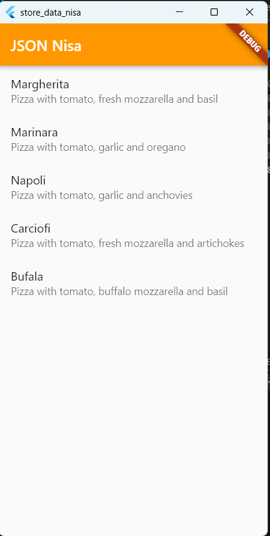
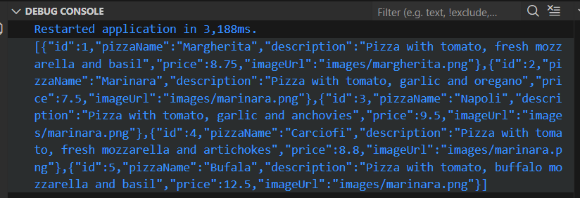

# Praktikum Codelab_12: Lanjutan State Management dengan Streams

| Absen | NIM        | Nama            |
|-------|------------|-----------------|
| 18    | 2341720057 | Khoirotun Nisa' |

---

# Praktikum 1: Dart Streams

## Langkah 1: Buat Project Baru


## langkah 2: `main.dart`
```dart
import 'package:flutter/material.dart';

void main() {
  runApp(const MyApp());
}

class MyApp extends StatelessWidget {
  const MyApp({super.key});

  // This widget is the root of your application.
  @override
  Widget build(BuildContext context) {
    return MaterialApp(
      title: 'Flutter JSON Demo Nisa',
      theme: ThemeData(primarySwatch: Colors.orange),
      home: const MyHomePage(),
    );
  }
}

class MyHomePage extends StatefulWidget {
  const MyHomePage({super.key});

  @override
  State<MyHomePage> createState() => _MyHomePageState();
}

class _MyHomePageState extends State<MyHomePage> {
  @override
  Widget build(BuildContext context) {
    return Scaffold(
      appBar: AppBar(title: const Text('JSON Nisa')),
      body: Container(),
    );
  }
}
```

*Soal 1*
1. Tambahkan nama panggilan Anda pada title app sebagai identitas hasil pekerjaan Anda.
2. Gantilah warna tema aplikasi sesuai kesukaan Anda.
3. Lakukan commit hasil jawaban Soal 1 dengan pesan "W13: Jawaban Soal 1"

## Langkah 3-10

`main.dart`

```dart
class _MyHomePageState extends State<MyHomePage> {
  String pizzaString = '';
  
  @override
  void initState() {
    super.initState();
    readJsonFile();
  }
  
  Future readJsonFile() async {
    String myString = await DefaultAssetBundle.of(context)
        .loadString('assets/pizzalist.json');
    setState(() {
      pizzaString = myString;
    });
  }
  @override
  Widget build(BuildContext context) {
    return Scaffold(
      appBar: AppBar(title: const Text('JSON Nisa')),
      body: Text(pizzaString),
    );
  }
}
```

`pubspec.yaml`
```dart
  assets:
    - assets/
```

`pizzalist.json`



**Hasil**



**Soal 2**
1. Masukkan hasil capture layar ke laporan praktikum Anda.
2. Lakukan commit hasil jawaban Soal 2 dengan pesan "W13: Jawaban Soal 2"

## Langkah 11-22

`lib/model/pizza.dart`
```dart
class Pizza {
  final int id;
  final String pizzaName;
  final String description;
  final double price;
  final String imageUrl;

  Pizza({
    required this.id,
    required this.pizzaName,
    required this.description,
    required this.price,
    required this.imageUrl,
  });

  Pizza.fromJson(Map<String, dynamic> json)
      : id = json['id'],
        pizzaName = json['pizzaName'],
        description = json['description'],
        price = (json['price'] as num).toDouble(),
        imageUrl = json['imageUrl'];
}
```
`main.dart`
```dart
import 'dart:convert';
import 'package:flutter/material.dart';
import 'model/pizza.dart';

...
class _MyHomePageState extends State<MyHomePage> {
  List<Pizza> myPizzas = [];
  
  @override
  void initState() {
    super.initState();
    readJsonFile().then((value) {
      setState(() {
        myPizzas = value;
      });
    });
  }

  Future<List<Pizza>> readJsonFile() async {
    String myString = await DefaultAssetBundle.of(context)
        .loadString('assets/pizzalist.json');
    List pizzaMapList = jsonDecode(myString);
    List<Pizza> myPizzas = [];
    for (var pizza in pizzaMapList) {
      Pizza myPizza = Pizza.fromJson(pizza);
      myPizzas.add(myPizza);
    }
    return myPizzas;
  }
  @override
  Widget build(BuildContext context) {
    return Scaffold(
      appBar: AppBar(title: const Text('JSON Nisa')),
      body: ListView.builder(
        itemCount: myPizzas.length,
        itemBuilder: (context, index) {
          return ListTile(
            title: Text(myPizzas[index].pizzaName),
            subtitle: Text(myPizzas[index].description),
          );
        },
      ),
    );
  }
}

```

**Hasil**




**Soal 3**
1. Masukkan hasil capture layar ke laporan praktikum Anda.
2. Lakukan commit hasil jawaban Soal 2 dengan pesan "W13: Jawaban Soal 3"


## Langkah 23-26
`main.dart`
```dart
class _MyHomePageState extends State<MyHomePage> {
  List<Pizza> myPizzas = [];
  
...

  Future<List<Pizza>> readJsonFile() async {
    ...
    String json = convertToJson(myPizzas);
    print(json);
    return myPizzas;
  }

  String convertToJson(List<Pizza> pizzas) {
    return jsonEncode(pizzas.map((pizza) => pizza.toJson()).toList());
  }
  @override
```

`lib/model/pizza.dart`
```dart
class Pizza {
...
  Map<String, dynamic> toJson() {
    return {
      'id': id,
      'pizzaName': pizzaName,
      'description': description,
      'price': price,
      'imageUrl': imageUrl,
    };
  }
}
```
**Debug console**


