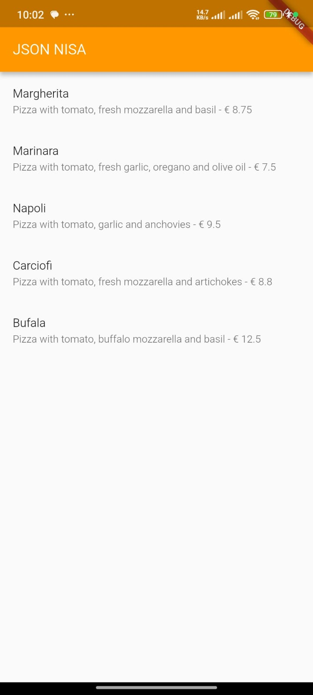
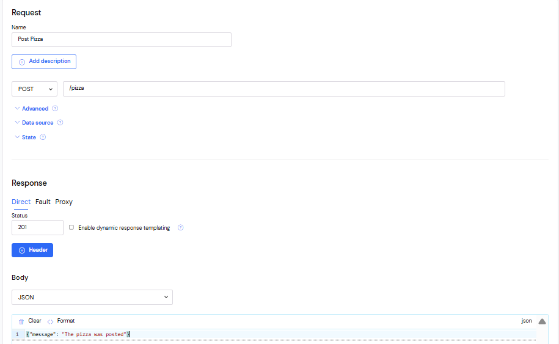
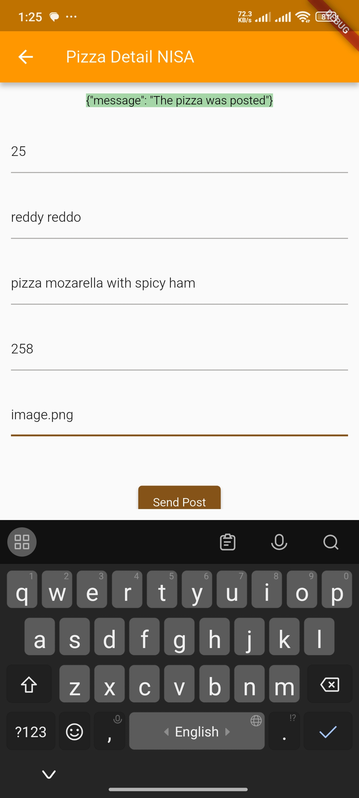

# Praktikum Codelab_14: RESTful API

| Absen | NIM        | Nama            |
|-------|------------|-----------------|
| 18    | 2341720057 | Khoirotun Nisa' |

---

# Praktikum 1: Membuat layanan Mock API

## Langkah 1: Wiremock


## `main.dart`
```dart
class _MyHomePageState extends State<MyHomePage> {
...
  Future<List<Pizza>> callPizzas() async {
    HttpHelper helper = HttpHelper();
    List<Pizza> pizzas = await helper.getPizzaList();
    return pizzas;
  }
...
  @override
  Widget build(BuildContext context) {
    return Scaffold(
      appBar: AppBar(title: const Text('JSON NISA')),
      body: FutureBuilder(
        future: callPizzas(),
        builder: (BuildContext context, AsyncSnapshot<List<Pizza>> snapshot) {
          if (snapshot.hasError) {
            // Show the real error message to help debugging
            return Center(
              child: Text('Error: ${snapshot.error}'),
            );
          }
          if (!snapshot.hasData) {
            return const Center(child: CircularProgressIndicator());
          }
          return ListView.builder(
            itemCount: (snapshot.data == null) ? 0 : snapshot.data!.length,
            itemBuilder: (BuildContext context, int position) {
              return ListTile(
                title: Text(snapshot.data![position].pizzaName),
                subtitle: Text(
                  snapshot.data![position].description +
                      ' - € ' +
                      snapshot.data![position].price.toString(),
                ),
              );
            },
          );
        },
      ),
    );
  }
}

```
## `httphelper.dart`
```dart
import 'dart:io';
import 'package:http/http.dart' as http;
import 'dart:convert';
import 'model/pizza.dart';

class HttpHelper {
  static final HttpHelper _httpHelper = HttpHelper._internal();
  HttpHelper._internal();
  factory HttpHelper() {
    return _httpHelper;
  }
  final String authority = 'q62vz.wiremockapi.cloud';
  final String path = '/pizzalist';
  Future<List<Pizza>> getPizzaList() async {
    final Uri url = Uri.https(authority, path);
    final http.Response result = await http.get(url);
    if (result.statusCode == HttpStatus.ok) {
      final jsonResponse = json.decode(result.body);
      //provide a type argument to the map method to avoid type
      //error
      List<Pizza> pizzas = jsonResponse
          .map<Pizza>((i) => Pizza.fromJson(i))
          .toList();
      return pizzas;
    } else {
      return [];
    }
  }
}

```

## Hasil



---

# Praktikum 2 : Mengirim Data ke Web Service (POST)

## Mock API



## `httphelper.dart`
```dart
Future<String> postPizza(Pizza pizza) async {
  const postPath = '/pizza';
  String post = json.encode(pizza.toJson());
  Uri url = Uri.https(authority, postPath);
  http.Response r = await http.post(
    url,
    body: post,
  );
  return r.body;
}
```

## `pizza_detail.dart`
```dart
import 'package:flutter/material.dart';
import 'model/pizza.dart';
import 'httphelper.dart';

class PizzaDetailScreen extends StatefulWidget {
  const PizzaDetailScreen({super.key});
  @override
  State<PizzaDetailScreen> createState() => _PizzaDetailScreenState();
}

final TextEditingController txtId = TextEditingController();
final TextEditingController txtName = TextEditingController();
final TextEditingController txtDescription = TextEditingController();
final TextEditingController txtPrice = TextEditingController();
final TextEditingController txtImageUrl = TextEditingController();
String operationResult = '';

class _PizzaDetailScreenState extends State<PizzaDetailScreen> {
  @override
  void dispose() {
    txtId.dispose();
    txtName.dispose();
    txtDescription.dispose();
    txtPrice.dispose();
    txtImageUrl.dispose();
    super.dispose();
  }

  @override
  Widget build(BuildContext context) {
    return Scaffold(
      appBar: AppBar(title: const Text('Pizza Detail NISA')),
      body: Padding(
        padding: const EdgeInsets.all(12),
        child: SingleChildScrollView(
          child: Column(
            children: [
              Text(
                operationResult,
                style: TextStyle(backgroundColor: Colors.green[200], color: Colors.black),
              ),
              const SizedBox(height: 24),
              TextField(
                controller: txtId,
                decoration: const InputDecoration(hintText: 'Insert ID'),
                keyboardType: TextInputType.number,
              ),
              const SizedBox(height: 24),
              TextField(
                controller: txtName,
                decoration: const InputDecoration(hintText: 'Insert Pizza Name'),
              ),
              const SizedBox(height: 24),
              TextField(
                controller: txtDescription,
                decoration: const InputDecoration(hintText: 'Insert Description'),
              ),
              const SizedBox(height: 24),
              TextField(
                controller: txtPrice,
                decoration: const InputDecoration(hintText: 'Insert Price'),
                keyboardType: TextInputType.number,
              ),
              const SizedBox(height: 24),
              TextField(
                controller: txtImageUrl,
                decoration: const InputDecoration(hintText: 'Insert Image Url'),
              ),
              const SizedBox(height: 48),
              ElevatedButton(
                child: const Text('Send Post'),
                onPressed: () {
                  postPizza();
                },
              ),
            ],
          ),
        ),
      ),
    );
  }

  Future postPizza() async {
    HttpHelper helper = HttpHelper();
    final int id = int.tryParse(txtId.text) ?? 0;
    final double price = double.tryParse(txtPrice.text) ?? 0.0;
    Pizza pizza = Pizza(
      id: id,
      pizzaName: txtName.text.trim(),
      description: txtDescription.text.trim(),
      price: price,
      imageUrl: txtImageUrl.text.trim(),
    );
    String result = await helper.postPizza(pizza);
    setState(() {
      operationResult = result;
    });
  }
}
```

## `main.dart`
```dart
      floatingActionButton: FloatingActionButton(
        child: const Icon(Icons.add),
        onPressed: () {
          Navigator.push(
            context,
            MaterialPageRoute(builder: (context) => const PizzaDetailScreen()),
          );
        },
      ),
```

## Hasil



## Soal 2
1. Tambahkan field baru dalam JSON maupun POST ke Wiremock!


2. Capture hasil aplikasi Anda berupa GIF di README dan lakukan commit hasil jawaban Soal 2 dengan pesan "W14: Jawaban Soal 2"